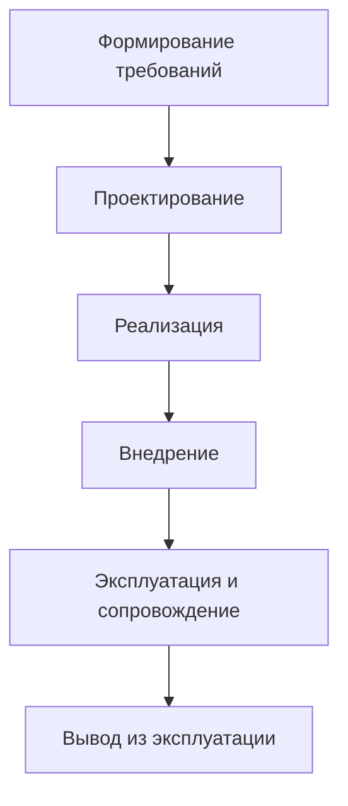

# Понятие жизненного цикла информационной системы и его значение

## Введение

Создание и эксплуатация современной информационной системы (ИС) — это сложный и продолжительный процесс, требующий системного подхода. Ключевым понятием, позволяющим управлять этим процессом от зарождения идеи до утилизации системы, является **жизненный цикл информационной системы (ЖЦ ИС)**.

## 1. Что такое жизненный цикл информационной системы?

**Жизненный цикл информационной системы** — это период времени, который начинается с момента принятия решения о необходимости создания ИС и заканчивается в момент ее полного изъятия из эксплуатации.

Методология проектирования ИС описывает процесс создания и сопровождения систем в виде жизненного цикла, представляя его как последовательность **стадий (этапов)** и выполняемых на них **процессов**. Формальное описание ЖЦ позволяет:

*   Спланировать и организовать процесс коллективной разработки.
*   Обеспечить управление этим процессом.
*   Определить для каждого этапа состав работ, результаты, методы, средства и ответственных лиц.

## 2. Стадии жизненного цикла ИС

**Стадия** — это часть процесса создания ИС, ограниченная временными рамками и заканчивающаяся выпуском конкретного продукта (моделей, документации, программных компонентов).

Несмотря на возможные вариации в зависимости от проекта, можно выделить универсальную последовательность стадий:

## Таблица 1. Ключевые стадии жизненного цикла ИС

| Стадия | Основные задачи и результаты |
|--------|-----------------------------|
| **1. Формирование требований** | Анализ предметной области, планирование работ, обследование объекта, построение моделей «As-Is» и «To-Be». **Результат:** Техническое задание, модели деятельности организации. |
| **2. Проектирование** | Определение архитектуры системы, функций, интерфейсов, требований к компонентам. **Результат:** Технический проект, спецификации. |
| **3. Реализация** | Непосредственное программирование, создание программных компонентов и баз данных. **Результат:** Готовый программный продукт, документация. |
| **4. Внедрение** | Установка и настройка системы, обучение пользователей, пробная эксплуатация. **Результат:** Система, введенная в промышленную эксплуатацию. |
| **5. Эксплуатация и сопровождение** |  Повседневная работа системы, техническая поддержка, исправление ошибок, адаптация и модернизация. **Результат:** Актуальная и работоспособная ИС. |
| **6. Вывод из эксплуатации** |  Миграция данных, остановка системы, утилизация оборудования. **Результат:** Прекращение использования системы. |

> **Примечание:** Особое значение имеет стадия формирования требований, на которой закладывается основа успеха всего проекта. Ошибки на этой стадии наиболее дорогостоящи в исправлении.

---

## 3. Процессы жизненного цикла ИС

Параллельно со стадиями, ЖЦ ИС рассматривается как совокупность процессов. Согласно международному стандарту **ISO/IEC 12207**, все процессы делятся на три группы:

## Классификация процессов по ISO/IEC 12207

### Основные процессы
*Непосредственно связаны с созданием и использованием системы* (например, разработка, эксплуатация).

### Вспомогательные процессы 
*Обеспечивают качественное выполнение основных процессов* (например, документирование, управление качеством).

### Организационные процессы
*Направлены на управление проектом и улучшение самих процессов ЖЦ.*

---

## 4. Стандарты и модели жизненного цикла

Существуют различные стандарты и методологии, регламентирующие ЖЦ ИС. Выбор модели зависит от специфики проекта, требований к гибкости и предсказуемости.

### Таблица 2. Сравнение моделей и стандартов ЖЦ ИС

| Модель/Стандарт | Тип модели | Ключевые особенности |
|-----------------|------------|----------------------|
| **ГОСТ 34.601-90** | Каскадная (водопадная) | Жесткая последовательность стадий. Четкая документальная регламентация. Хорош для проектов с ясными и неизменными требованиями. |
| **ISO/IEC 12207** | Процессно-ориентированная | Определяет группы процессов, а не стадии. Является основой для многих других стандартов. |
| **RUP (Rational Unified Process)** | Итеративная и инкрементальная | Включает 4 фазы: начало, исследование, построение, внедрение. Разработка ведется итерациями, каждая из которых выпускает рабочую версию. |
| **MSF (Microsoft Solution Framework)** | Итеративная | Сходна с RUP. Включает фазы: анализ, проектирование, разработка, стабилизация. Ориентирована на разработку бизнес-приложений. |
| **Extreme Programming (XP)** | Гибкая | Акцент на командной работе, частых выпусках, постоянном взаимодействии с заказчиком и быстрой адаптации к изменениям. |

> **Примечание:** В современной практике все большую популярность набирают **гибкие** методологии, такие как Scrum и Kanban, которые, по сути, являются эволюцией итеративных моделей и ориентированы на быструю реакцию на изменения требований.

---

## 5. Значение жизненного цикла ИС

Понятие жизненного цикла имеет фундаментальное значение для успешной реализации проектов в области информационных технологий.

### **Систематизация и управляемость**
ЖЦ предоставляет структурированный подход, который превращает сложную задачу создания ИС в управляемый последовательный процесс с четкими контрольными точками.

### **Планирование и прогнозирование**
Формальное описание этапов и процессов позволяет более точно оценивать сроки, бюджет и необходимые ресурсы, что критически важно для управления проектами.

### **Обеспечение качества**
Вспомогательные процессы (верификация, аттестация, обеспечение качества), встроенные в ЖЦ, позволяют на постоянной основе контролировать соответствие системы заданным требованиям.

### **Снижение рисков**
Такой подход позволяет выявлять проблемы и отклонения на ранних стадиях, когда их исправление наименее затратно. Моделирование «As-Is» и «To-Be» на этапе формирования требований помогает избежать создания системы, не решающей бизнес-задачи.

### **Эффективное взаимодействие**
Четкое распределение ролей, ответственности и документирование на каждом этапе улучшает коммуникацию между всеми участниками проекта: заказчиками, разработчиками, аналитиками и тестировщиками.

### **Учет длительной перспективы**
ЖЦ подчеркивает, что создание системы — это только начало. Стадии эксплуатации, сопровождения и вывода из эксплуатации требуют не менее тщательного планирования, так как именно на них приходится основная часть затрат в течение всей жизни системы.

---

## Заключение

Таким образом, **жизненный цикл информационной системы** — это не просто теоретическое понятие, а практический инструмент, который обеспечивает дисциплину, контроль и предсказуемость на всем пути от идеи до утилизации ИС. Понимание и грамотное применение принципов ЖЦ, адаптированных под конкретный проект и выбранную методологию, является ключевым фактором для создания качественных, надежных и эффективных информационных систем, отвечающих потребностям бизнеса.