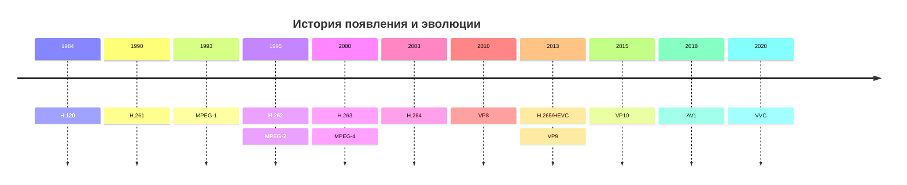

## **Роль кодеков и форматов в обеспечении совместимости мультимедиа**

---

**Введение**

В современном цифровом мире мы ежедневно потребляем огромное количество мультимедийного контента: смотрим видео в интернете, слушаем музыку, обмениваемся фотографиями. За кадром этой кажущейся простоты скрывается сложная технологическая инфраструктура, ключевыми элементами которой являются **кодеки** и **форматы мультимедиа-файлов**. Именно они обеспечивают возможность записи, хранения, передачи и воспроизведения аудио и видео на самых разных устройствах. Цель данного доклада — разобраться, что такое кодеки и форматы, какова их роль и как они обеспечивают совместимость мультимедиа.

---

#### **1. Понятия кодека и формата**

Часто эти два понятия путают, но они выполняют разные функции.

* **Кодек — это алгоритм или программа, предназначенная для сжатия (кодирования)** и **распаковки (декодирования)** мультимедийных данных (аудио и видео).
  
  * **Функция:** Сжать исходный файл для уменьшения его размера. "Сырое" несжатое видео (например, с камеры) занимает гигантские объемы памяти (несколько гигабайт в секунду). Кодек устраняет избыточность и психоакустическую/психовизуальную информацию, которую человек не воспринимает, заметно уменьшая размер файла.
  * **Примеры кодеков:** H.264, H.265 (HEVC), AV1, VP9.

* **Формат мультимедиа-контейнера (Container Format)** — это "обертка", которая хранит в себе:
  
  1. Потоки данных, сжатые различными кодеками (например, один видео-поток, один или несколько аудио-потоков, субтитры).
  2. **Метаданные:** информацию о самом файле (название, автор, дата создания), а также служебные данные для синхронизации аудио и видео.
  * **Функция:** Организация, хранение и синхронизация разных типов данных в одном файле. Контейнер определяет структуру файла, но не влияет напрямую на метод сжатия.
  * **Примеры контейнеров:** MP4, AVI, MKV, WebM, MOV.

---

#### **2. История появления и эволюции**

* **1984 – Начало**. Появляется первая технология кодирования видео **H.120**, позволявшая передавать **NTSC** (National Television System Committee) и **PAL** (Phase Alternating Line) видео.
* **1990 - Эра цифрового аудио и видео:** Практическое сжатие видео начинается с 90-х годов со стандартов **H.261** и **MPEG-1**.  Позже стал доминировать стандарт **MPEG-2**, использовавшийся на DVD и в цифровом телевидении.
* **2000-е – Стандартизация и патентные войны:** Формат **MP4** на базе кодека **H.264** стал золотым стандартом для онлайн-видео (YouTube, Vimeo) и высококачественного контента (Blu-ray). В это же время обострилась конкуренция между проприетарными (H.264) и открытыми (Ogg Vorbis, Theora) технологиями.
* **2010-е – наше время – Гонка за эффективность:** Рост популярности видео в 4K/8K и потоковой передачи потребовал новых, более эффективных кодеков. Представителями этого поколения были:
  * **H.265/HEVC:** Преемник H.264, предлагающий вдвое лучшее сжатие, но с сложной патентной лицензией.
  * **VP9 (Google):** Открытый и бесплатный конкурент HEVC, ставший основой для YouTube.
  * **AV1 (Alliance for Open Media):** Новейший открытый и бесплатный кодек, превосходящий по эффективности HEVC и VP9. Становится основным для стриминга (Netflix, YouTube).

---

#### **3. Функции кодеков и форматов в обеспечении совместимости**

Их роль можно разделить на несколько ключевых аспектов:

**1. Эффективное сжатие и передача данных.**
Кодеки позволяют передавать видео и аудио через интернет-каналы с ограниченной пропускной способностью. Без них просмотр фильма в HD-качестве требовал бы гигабитных скоростей и занимал терабайты дискового пространства.

**2. Универсальность воспроизведения (Совместимость между устройствами и ПО).**

* **Форматы-контейнеры** обеспечивают совместимость на структурном уровне. Плеер (декодер), зная структуру контейнера (например, MP4), может "распаковать" его, извлечь видео- и аудиопотоки и отправить их на соответствующие кодеки для декодирования.
* Для обеспечения полной совместимости устройство или программа должны поддерживать как **контейнер**, так и **кодеки**, использованные внутри него. Если видеоплеер "понимает" контейнер MKV, но не имеет кодека H.265 для декодирования видеопотока, файл не воспроизведется.

**3. Гибкость и функциональность.**
Современные контейнеры (например, **MKV** или **MP4**) позволяют хранить множество дорожек: несколько аудио-дорожек на разных языках, несколько наборов субтитров, главы и т.д. Пользователь может переключаться между ними на лету, что и обеспечивает удобство.

**4. Поддержка современных возможностей.**
Новые кодеки и форматы разрабатываются с учетом актуальных требований:

* **HDR (High Dynamic Range)** для большего диапазона цветов и яркости.
* **Высокие частоты кадров (60fps, 120fps).**
* **Адаптивный стриминг** (технология, используемая в YouTube, Netflix), где видео разбито на сегменты разного качества, и плеер динамически выбирает подходящий сегмент в зависимости от скорости интернета.

---

#### 4. Отличия разных кодеков и форматов

**Примеры отличий кодеков:**

* **H.264 vs AV1:** H.264 — старый, хорошо поддерживаемый стандарт; AV1 — новый, на 30% эффективнее, но требует более мощного процессора для декодирования.

**Примеры отличий форматов:**

* **AVI vs MKV:** AVI — устаревший, не поддерживает современные функции (например, HDR) и некоторые кодеки. MKV (Matroska) — очень гибкий, поддерживает почти все, что угодно, но не всегда совместим со старыми устройствами.
* **MP4 vs WebM:** MP4 — универсальный "индустриальный" стандарт. WebM — контейнер от Google на базе MKV, ориентированный на открытые кодеки (VP9, AV1, Opus) и веб.

---

#### **Заключение**

Кодеки и форматы мультимедиа-контейнеров являются фундаментальными технологиями, без которых современный цифровой мир был бы невозможен. Они работают дуэтом: **кодеки** решают задачу эффективного сжатия данных, а **форматы** — задачу их корректной организации и синхронизации. Их эволюция — это постоянный поиск баланса между качеством, размером файла и вычислительной сложностью.

Именно широкое распространение и поддержка определенных пар "кодек-формат" (как, например, дуэт H.264 + MP4) обеспечивают ту самую **совместимость**, которая позволяет нам смотреть один и тот же фильм на смартфоне, компьютере и Smart-TV, не задумываясь о технических сложностях, скрытых под поверхностью удобного интерфейса.
