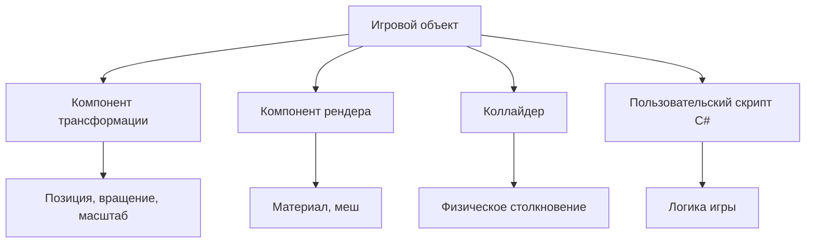
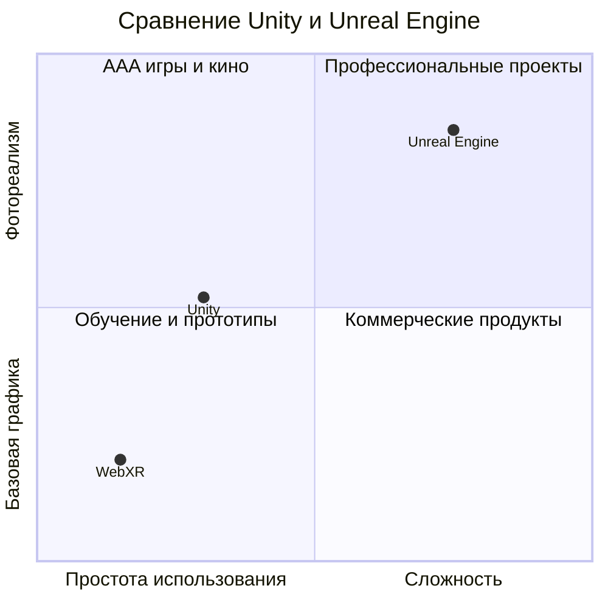
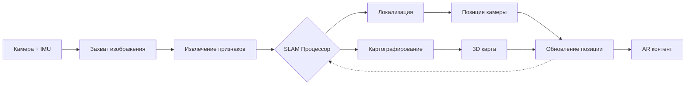
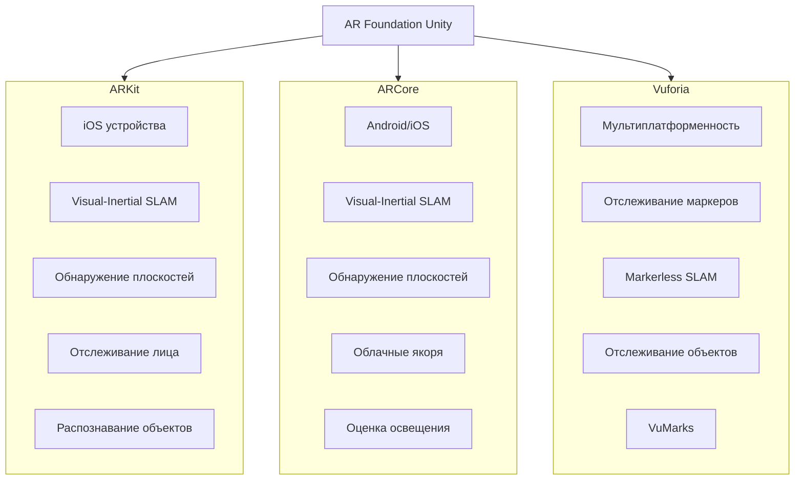
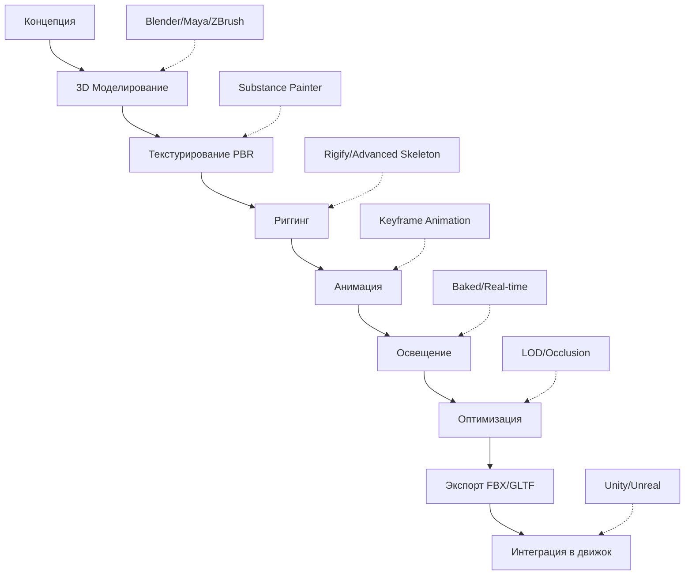
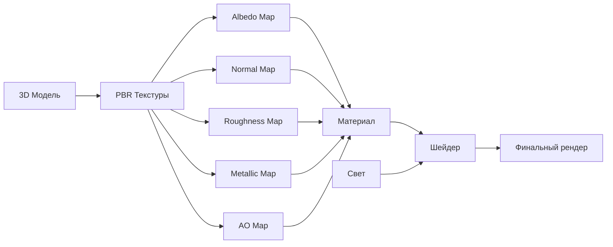
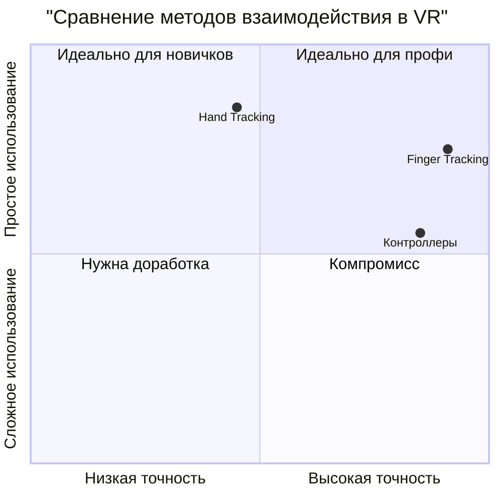
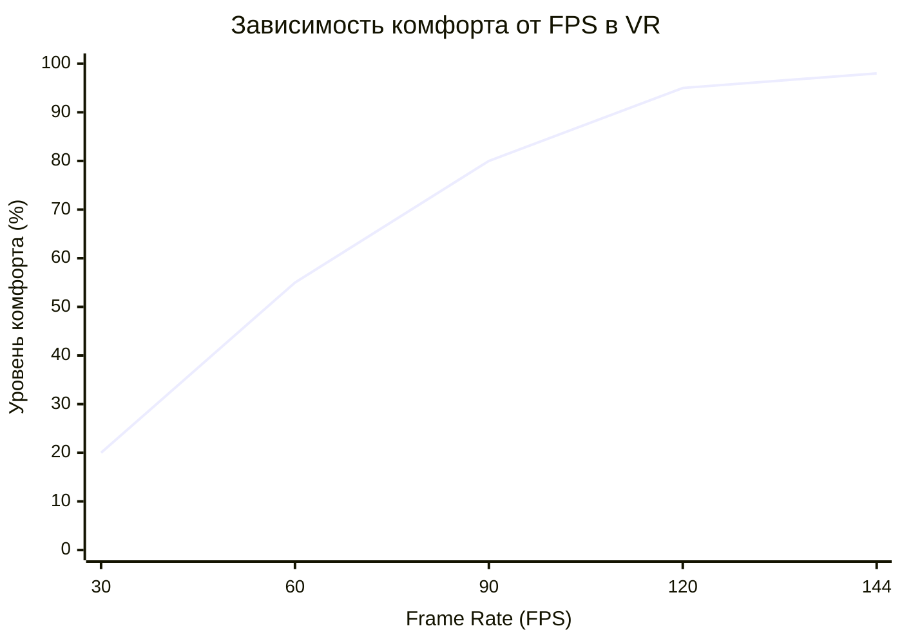
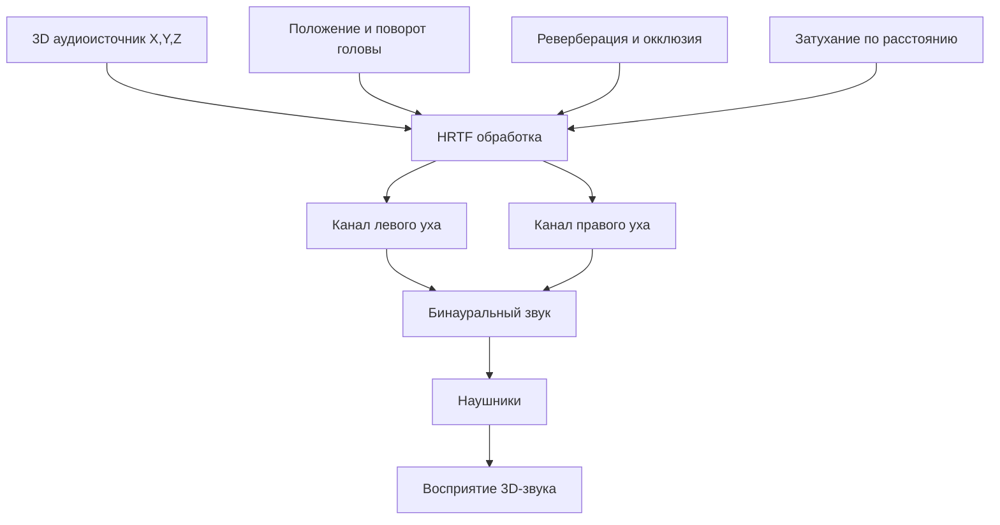

# Среды и инструменты для разработки контента в AR/VR.

### 1. Игровые двигатели: Unity vs. Unreal Engine

Выбор правильного двигателя — это одно из самых важных решений при разработке AR/VR контента. На сегодняшний день Unity и Unreal Engine доминируют в индустрии, но каждый имеет собственные сильные стороны.

**Unity** — это полнофункциональная среда разработки, созданная компанией Unity Technologies. Она получила широкое распространение благодаря своей доступности и гибкости.

Архитектура Unity:
- **Компонентная система**: основана на Entity-Component-System (ECS) архитектуре, где каждый игровой объект состоит из набора компонентов (Transform, Renderer, Collider и т.д.). Разработчик комбинирует компоненты для создания нужного поведения.
- **Язык программирования**: использует **C#** — язык с управлением памятью через сборщик мусора (garbage collection), что упрощает разработку и снижает риск ошибок управления памятью.
- **Кроссплатформенность**: Unity поддерживает развертывание на 25+ платформах: Windows, macOS, Linux, iOS, Android, WebGL, PlayStation, Xbox, Nintendo Switch, и различные VR-платформы (Meta Quest, HTC Vive, Valve Index).

Преимущества Unity для AR/VR:
- **Простота освоения**: Unity имеет логичный интерфейс и пологую кривую обучения
- **Быстрая итерация**: компонентная система позволяет быстро прототипировать
- **Огромное сообщество**: существует множество документации, туториалов и готовых решений (Asset Store)
- **Бесплатность**: абсолютно бесплатна для разработчиков с доходом до $200,000 в год
- **Поддержка мобильной VR**: Unity хорошо подходит для мобильных VR приложений благодаря оптимизации для Android

Недостатки Unity:
- **Производительность графики**: встроенный рендер-движок (Scriptable Render Pipeline) менее оптимален для очень сложных графических сцен по сравнению с Unreal
- **Сложность оптимизации**: разработчик должен сам заботиться об оптимизации производительности

**Unreal Engine** — промышленный стандарт для высокопроизводительных приложений, разработанный компанией Epic Games.

Архитектура Unreal Engine:
- **Объектная система**: построена на классовой иерархии (AActor — базовый класс для всех игровых объектов), предоставляя более строгую структуру, чем компонентная система
- **Язык программирования**: использует **C++** для критически важного кода и **Blueprints** — визуальный язык программирования для логики более высокого уровня. C++ предоставляет максимальный контроль над памятью и производительностью
- **Специализация**: исторически разработана для графически сложных AAA-проектов

Преимущества Unreal для AR/VR:
- **Превосходная графика**: Lumen (глобальное освещение в реальном времени) и Nanite (система управления геометрией высокого разрешения) обеспечивают фотореалистичное качество
- **Высокая производительность**: оптимизирован для обработки сложных сцен с сохранением высокой частоты кадров (120+ FPS), критичной для VR
- **Инструменты анимации**: превосходные инструменты анимации включая Control Rig (скелетная анимация)
- **Киноматографическое качество**: предпочитают кинематографисты и разработчики, требующие высочайшего качества визуализации

Недостатки Unreal:
- **Сложность освоения**: C++ требует глубокого понимания программирования среди новичков
- **Объемное хранилище**: проекты Unreal занимают больше дискового пространства
- **Требования к ресурсам**: требует более мощных компьютеров для разработки

**Сравнение для AR/VR проектов:**

| Аспект | Unity | Unreal Engine |
|---|---|---|
| **Для мобильной VR** | Отличный выбор | Менее подходит |
| **Для высококачественного контента** | Хороший | Лучший выбор |
| **Для быстрого прототипирования** | Лучше | Медленнее |
| **Для новичков** | Лучше | Сложнее |
| **Производительность on console** | Хорошая | Отличная |
| **Поддержка VR SDKs** | Обширная | Обширная |

**Веб-платформы: WebXR и A-Frame**

Для веб-базированного AR/VR контента существует альтернатива:

- **WebXR API**: открытый стандарт, позволяющий создавать AR/VR опыты, запускаемые прямо в веб-браузере без установки приложений. Использует JavaScript и WebGL.
- **A-Frame**: фреймворк, построенный на базе Three.js, который упрощает разработку WebXR контента с помощью HTML-подобного синтаксиса и Entity-Component-System архитектуры.

Преимущества WebXR: низкий порог входа, кроссплатформенность, моментальное развертывание. Недостатки: меньше контроля над производительностью, ограниченный доступ к аппаратным возможностям.

**A-Frame** отлично подходит для быстрых, кроссплатформенных, экспериментальных и образовательных проектов, но для высокопроизводительных, мультиплатформенных и коммерческих продуктов может потребоваться использование более низкоуровневых инструментов.

### 2. Отслеживание в AR: маркерное vs. безмаркерное

Отслеживание позиции объектов и окружения — это сердце AR опыта. Существует два основных подхода.

**Маркерное отслеживание (Marker-based tracking)**

В маркерном подходе AR система требует видимого маркера в реальном мире — обычно это QR-код или специальный черно-белый паттерн. Процесс:

1. Маркер проектируется в реальное пространство (на бумаге, объекте, т.д.)
2. Камера мобильного устройства распознает маркер по его уникальному паттерну
3. Система вычисляет позицию и ориентацию маркера относительно камеры
4. Виртуальный контент накладывается точно на маркер

Преимущества маркерного подхода:
- **Высокая точность**: маркер специально разработан для однозначного распознавания
- **Низкая вычислительная стоимость**: распознавание маркера требует минимальных вычислений
- **Предсказуемость**: система всегда знает, где искать контент

Недостатки:
- **Требование физического маркера**: маркер должен быть видим камере
- **Ограниченная гибкость**: контент должен быть ассоциирован с конкретным маркером
- **Плохой пользовательский опыт**: нужно сначала найти маркер, чтобы увидеть AR контент

**Безмаркерное отслеживание (Markerless tracking)**

Безмаркерное отслеживание использует **SLAM (Simultaneous Localization and Mapping)** — одну из самых сложных и полезных технологий в компьютерном зрении.

Принцип SLAM:

1. **Локализация (Localization)**: система определяет, где находится камера в 3D пространстве, используя данные о движении (inertial measurement unit, IMU) и визуальные ориентиры
2. **Картографирование (Mapping)**: одновременно строит 3D карту окружающей среды, отслеживая характерные черты (features) в видеопотоке
3. **Итеративный процесс**: эти два процесса происходят одновременно и постоянно уточняют друг друга

Технические детали:
- **Визуальные особенности (Visual Features)**: система ищет уникальные текстурированные точки в окружении (края, углы, интересные паттерны)
- **Кинематическая модель**: используется информация о движении камеры для предсказания позиции в следующем кадре
- **Трулокализация ошибок (Bundle Adjustment)**: оптимизационный процесс, который минимизирует ошибки в оценке позиции и карте

Преимущества безмаркерного подхода:
- **Гибкость**: работает в любом окружении без предварительной подготовки
- **Естественность**: пользователь может разместить AR контент в любом месте
- **Масштабируемость**: одна система может работать в любом месте

Недостатки:
- **Высокая вычислительная стоимость**: требует обработки видеопотока в реальном времени
- **Возможность дрейфа**: накопление ошибок может привести к расхождению локализации
- **Зависимость от текстуры окружения**: в текстурно-бедных окружениях (белые стены, однородные поверхности) может работать плохо

**Платформы и фреймворки**

**ARKit (Apple)**
- Платформа: iOS 11.0 и выше
- Технология: визуально-инерциальный SLAM
- Особенности: отслеживание позиции, обнаружение плоскостей, оценка света, отслеживание лиц, распознавание объектов
- Преимущества: отличная интеграция с iOS, высокая точность
- Недостатки: только iOS

**ARCore (Google)**
- Платформы: Android 7.0+, iOS 11.0+
- Технология: визуально-инерциальный SLAM (аналогично ARKit)
- Особенности: аналогичны ARKit + облачные якоря (cloud anchors)
- Преимущества: кроссплатформенность, бесплатность
- Недостатки: ниже по сравнению с ARKit на iOS

**Vuforia**
- Платформы: iOS, Android, UWP, Unity Editor
- Подход: гибридный (маркерное отслеживание + SLAM)
- Особенности: отслеживание образов и объектов, VuMarks (комбинация QR и маркеров), отслеживание граней
- Преимущества: промышленный стандарт, поддержка объектов и образов высокого качества
- Недостатки: дорогостоящее для коммерческого использования

**AR Foundation (Unity)**
- Абстрактный слой над ARKit и ARCore, позволяющий разработчикам писать код один раз, работающий на обеих платформах
- Поддерживает основные функции ARKit/ARCore

### 3. Конвейер создания 3D контента для AR/VR

Создание высококачественного 3D контента требует сложного многоэтапного процесса, где каждый инструмент специализирован на определенной задаче.

Этап 1: Концепция и раскадровка

Перед тем как начать создавать 3D модели, важно разработать четкую концепцию проекта:
- Визуальный стиль проекта
- Ключевые объекты и персонажи
- Сценарий взаимодействия
- Раскадровка (storyboards) для повествовательных элементов

Этап 2: 3D моделирование

**Blender** — это бесплатный, открытый инструмент для 3D моделирования, считающийся лучшим выбором для независимых разработчиков благодаря своей функциональности и отсутствию платежей.

Процесс моделирования:
1. Начинаем с примитива (куба, сферы, плоскости)
2. Используем операции вроде Extrude (выдавливание), Bevel (скос), Loop Cut для создания геометрии
3. Детализируем модель, добавляя полигоны где нужно

**Maya** и **3ds Max** от Autodesk — промышленные стандарты в производственных студиях, предлагают более продвинутые инструменты, но требуют платной подписки.

**ZBrush** — специализированный инструмент для скульптурной лепки высокодетальных органических форм (персонажи, монстры, животные). Использует парадигму цифровой скульптуры, что более интуитивно для художников.

Оптимизация геометрии:
- **High-poly модель**: создается с максимальной детальностью (часто 100K+ полигонов)
- **Low-poly модель**: оптимизированная версия для реального времени (обычно 10K-50K полигонов для персонажей, еще меньше для реквизита)
- **Нормальные карты (Normal Maps)**: сохраняют детали high-poly модели в виде текстуры, применяемой на low-poly, создавая иллюзию большего количества деталей без увеличения полигонов

Этап 3: Текстурирование и раскраска

**Substance Painter** — доминирующий инструмент для текстурирования, использует парадигму физически-обоснованного рендеринга (Physically-Based Rendering, PBR).

PBR рабочий процесс:
- **Альбедо (Diffuse)**: базовый цвет поверхности без освещения
- **Нормали (Normal Map)**: кодируют микрорельефы поверхности для детализации освещения
- **Roughness**: определяет, насколько шершава поверхность (0 = зеркальная, 1 = диффузная)
- **Metallic**: определяет, является ли поверхность металлом (1) или диэлектриком (0)
- **Ambient Occlusion (AO)**: тени в углах и щелях

PBR важна для VR/AR, потому что:
- Материалы выглядят реалистично при различных условиях освещения
- Одинаковый набор текстур работает в любом движке (Unity, Unreal, Babylon.js)
- Физически верное поведение света облегчает интеграцию виртуального контента в реальное окружение

Этап 4: Риггинг

**Риггинг** — это создание цифрового скелета для персонажа, позволяющего его анимировать.

Процесс риггинга:
1. Создание костей (bones) — виртуального скелета внутри модели
2. Weight painting — определение, какие вершины модели влияют каждая кость (эта часть модели изгибается при движении кости)
3. Создание контроль-риг (control rig) — удобный интерфейс для аниматора (вместо прямого манипулирования костями)

Инструменты риггинга:
- **Blender Rigify**: автоматическое создание rig'а для гуманоидных персонажей
- **Advanced Skeleton (Maya plugin)**: промышленный стандарт для быстрого риггинга
- **Meshy AI Rigging**: новая технология на базе AI, которая автоматически риксирует модели одним кликом

Этап 5: Анимация

После риггинга модель готова к анимации.

Процесс анимации:
1. **Keyframe animation**: аниматор устанавливает ключевые позы (keyframes) в определенные моменты времени
2. **Интерполяция**: программа автоматически генерирует промежуточные позы между keyframes
3. **Кривые анимации (Animation curves)**: уточнение движения через редактор кривых (curve editor), контролирующий скорость и ускорение

Типы анимаций:
- **Скелетная анимация (Skeletal animation)**: кости движутся, модель деформируется
- **Морф-анимация (Morph animation)** / Shape Keys: прямая деформация геометрии (для выражений лица, например)
- **Вершинная анимация (Vertex animation)**: каждая вершина может иметь собственное движение (для волн, жидкостей)

Этап 6: Освещение

Освещение критично для создания настроения и направления внимания пользователя.

Типы освещения:
- **Directional Light (солнце)**: симулирует солнечный свет издалека
- **Point Light (точечный свет)**: свет, излучаемый из точки во все стороны (лампочка)
- **Spot Light**: направленный свет с конусом (прожектор)
- **Ambient Light**: общее окружающее освещение

Для VR/AR:
- **Baked lighting**: предварительно вычисленное статичное освещение, сохраняется в текстурах. Быстро, но не может быть динамичным
- **Real-time lighting**: вычисляется каждый кадр. Замедляет производительность, но позволяет динамичное освещение (например, свет от факелов в игре)

Этап 7: Рендеринг и оптимизация

Окончательный рендер происходит при интеграции в движок:

- **Offline rendering** (для кинематических секвенций): максимальное качество, может занять часы
- **Real-time rendering** (для интерактивных приложений): должен выполняться в реальном времени (60+FPS), требует оптимизации

Оптимизация:
- **LOD (Level of Detail)**: разные версии модели с разным количеством полигонов
- **Occlusion culling**: не рендерим объекты, которые не видны
- **Draw call batching**: комбинируем несколько объектов в один вызов рендеринга

**Интеграция в движки:**

После создания 3D контента в Blender/Maya, он экспортируется в стандартные форматы:

- **FBX**: универсальный формат для моделей, скелетов и анимаций. Поддерживается всеми движками
- **GLTF/GLB**: открытый стандарт, предпочитаемый для веб-приложений (WebGL, Three.js)
- **USD** (Universal Scene Description): новый универсальный формат, поддерживаемый Pixar, NVIDIA и другими

Файл импортируется в движок (Unity/Unreal), где:
- Настраиваются материалы и освещение для конкретного движка
- Добавляются компоненты (коллайдеры, триггеры, скрипты)
- Интегрируется в интерактивный опыт

### 4. Взаимодействие в VR: контроллеры vs. отслеживание рук vs. отслеживание пальцев

Способ взаимодействия пользователя с VR окружением определяет как комфортность, так и возможности опыта.

**Контроллеры (Physical Controllers)**

Традиционный подход, где пользователь держит физический контроллер, отслеживаемый в пространстве.

Архитектура контроллеров:
- **6DOF отслеживание (Six Degrees of Freedom)**: система отслеживает положение (X, Y, Z) и ориентацию (pitch, yaw, roll) контроллера
- **Кнопки и аналоговые стики**: обеспечивают дополнительные способы ввода
- **Тактильная обратная связь (Haptic feedback)**: вибрация, которая сообщает пользователю об событиях

Примеры контроллеров:
- Meta Quest 2/3 Controllers: отслеживаются через инфракрасные датчики
- HTC Vive Controllers: отслеживаются через SteamVR Lighthouse система
- Valve Index Controllers: продвинутое отслеживание с отслеживанием пальцев

Преимущества контроллеров:
- **Надежность**: точное отслеживание даже в сложных условиях
- **Точность ввода**: кнопки и стики предоставляют быстрый и точный ввод
- **Производительность**: не требует обработки видео в реальном времени
- **Тактильная обратная связь**: вибрация помогает с иммерсией

Недостатки контроллеров:
- **Слабая интуитивность**: для новичков неясно, как взаимодействовать
- **Требует держать объект**: пользователь должен всегда держать контроллер

**Отслеживание рук (Hand Tracking)**

Более новый подход, при котором вместо контроллеров система отслеживает положение рук пользователя через встроенные камеры.

Технология:
- **Встроенные камеры**: обычно 2 внешние камеры отслеживают руки в реальном времени
- **Компьютерное зрение**: нейросетевые модели (обученные на тысячах примеров) вычисляют позицию каждого сустава руки
- **21-суставное представление**: каждая рука представлена 21 3D точкой (запястье, костяшки пальцев, кончики пальцев)

Примеры реализации:
- Meta Quest 2+ (встроенное отслеживание рук)
- Apple Vision Pro (очень точное отслеживание рук)

Преимущества отслеживания рук:
- **Интуитивность**: новичок может сразу начать пользоваться (не нужно учить кнопки)
- **Иммерсивность**: видеть собственные руки в VR усиливает присутствие
- **Простота использования**: для коротких сессий лучше, чем контроллеры
- **Отсутствие физических контроллеров**: нечего потерять или сломать

Недостатки отслеживания рук:
- **Менее надежно**: могут быть проблемы с окклюзией (одна рука загораживает другую)
- **Менее точно**: требует больше времени для вычисления позиции
- **Сложнее для сложных взаимодействий**: нет физических кнопок, нужно использовать жесты (hand gestures)
- **Требует хорошего освещения**: камеры должны четко видеть руки

**Отслеживание пальцев (Finger Tracking)**

Продвинутая технология, при которой отслеживается позиция каждого отдельного пальца с высокой точностью.

Применение:
- **Fine-grained взаимодействие**: пользователь может прикасаться к виртуальным кнопкам, писать, рисовать
- **Haptic feedback**: комбинируется с haptic перчатками для осязательной обратной связи

Примеры использования:
- Инженерные симуляции: касание объектов для инспекции
- Медицинское обучение: точное взаимодействие с объектами
- Фортепиано в VR: каждый палец на отдельной клавише

Недостатки:
- **Дорогостоящее**: требует специального оборудования (haptic перчатки)
- **Сложность**: требует тщательной калибровки
- **Нишевое применение**: не для всех типов приложений

**Сравнение методов:**

| Критерий | Контроллеры | Hand Tracking | Finger Tracking |
|---|---|---|---|
| **Точность** | Высокая | Средняя | Очень высокая |
| **Надежность** | Высокая | Средняя | Высокая |
| **Интуитивность** | Средняя | Высокая | Высокая |
| **Стоимость** | Средняя | Низкая | Очень высокая |
| **Для новичков** | Нелегко | Легко | Очень легко |
| **Для длительных сессий** | Хорошо | Утомительно | Хорошо |

**Дизайн взаимодействия:**

При выборе метода взаимодействия разработчик должен учитывать:
- **Целевая аудитория**: новички предпочитают интуитивные руки, опытные могут предпочесть контроллеры
- **Тип опыта**: игра требует быстрого точного ввода (контроллеры), социальное приложение может использовать руки
- **Длительность сессии**: короткие сессии хороши для рук, длительные сессии для контроллеров
- **Природа взаимодействия**: касание/рисование требует отслеживания рук/пальцев, быстрые действия требуют контроллеров

### 5. Производительность в VR: частота кадров, пространственный звук, латентность

Одна из главных причин отказа пользователей от VR — это **киберболезнь (cyber-sickness)** или **укачивание в VR (VR-sickness)**. Это вызвано рассогласованием между тем, что видят глаза, и тем, что чувствует вестибулярный аппарат (система равновесия во внутреннем ухе).

**Частота кадров (Frame Rate)**

Частота кадров определяется как количество изображений, которые система отображает в секунду, измеряется в кадрах в секунду (frames per second, FPS).

Критически важны для VR значения:

- **60 FPS**: минимум для VR, но уже вызывает укачивание у некоторых пользователей
- **90 FPS**: рекомендуемая частота, большинство пользователей чувствуют себя комфортно
- **120 FPS**: идеальная частота, практически исключает укачивание. Исследования показывают, что 120 FPS — это «магический порог», после которого улучшение субъективных ощущений становится минимальным
- **144+ FPS**: используется в премиум-приложениях и соревновательных играх

Почему низкие FPS вызывают укачивание:

Когда пользователь движет головой, изображение должно обновиться в реальном времени. Если FPS низкий:
1. Изображение обновляется с задержкой
2. Между движением головы и визуальным ответом появляется разрыв (latency)
3. Мозг получает конфликтующие сигналы: глаза видят движение, но вестибулярный аппарат не ощущает его в ожидаемый момент
4. Результат: тошнота и головокружение

**Оптимизация для высокого FPS:**

- **LOD (Level of Detail)**: использование менее детальных моделей в расстоянии
- **Occlusion Culling**: не рендеринга объектов, скрытых за другими объектами
- **Draw call batching**: комбинирование нескольких объектов в один вызов GPU
- **Shader optimization**: оптимизация графических шейдеров для быстрого выполнения

**Пространственный звук (Spatial Audio)**

Звук — часто забытый элемент VR иммерсии, но это один из самых важных компонентов.

Технология пространственного звука:

- **HRTF (Head-Related Transfer Function)**: математическая модель, которая имитирует, как звуковые волны преломляются головой, ушами и телом. Каждый человек имеет уникальную HRTF, что позволяет индивидуализировать звук
- **Object-based audio**: каждый звуковой эффект рассматривается как отдельный объект в 3D пространстве, имеющий координаты X, Y, Z
- **Динамическое отслеживание головы**: звук следует за движением головы, так что если пользователь поворачивает голову, звук переходит со стороны в сторону

Реализация пространственного звука:

1. **Захват (Capture)**: звук записывается с микрофонных массивов, которые захватывают пространственную информацию
2. **Обработка (Processing)**: HRTF алгоритмы применяются для создания иллюзии 3D расположения
3. **Рендеринг**: пространственный звук рендерится через наушники, используя метод бинауральной обработки

Типы пространственного звука:

- **Sound objects**: монозвуки, расположенные в 3D пространстве (звук падающего молотка)
- **Ambisonics**: 360-градусные звуковые поля, захватывающие полную сферу звука (окружающий шум, атмосфера)
- **Higher-Order Ambisonics (HOA)**: более точное представление 3D звука, требует больше каналов (до 64+)

**Минимизация латентности (Motion-to-Photon Latency)**

Латентность в VR — это время между движением пользователя и соответствующей визуальной реакцией на экране.

Процесс и источники задержки:

1. **Sensor latency** (задержка датчика): датчики головы (IMU) должны измерить ускорение, ~1-5 мс
2. **Processing latency** (задержка обработки): компьютер должен рассчитать новую позицию камеры, обновить сцену, отрендерить изображение, ~10-30 мс
3. **Display latency** (задержка дисплея): время, требуемое для дисплея для выключения старого пикселя и включения нового, ~5-10 мс

Общая латентность: 15-20 мс считается комфортной, >20 мс начинает вызывать укачивание.

```mermaid
gantt
    title Конвейер Motion-to-Photon Latency
    dateFormat X
    axisFormat %L ms
    
    section Движение головы
    Движение пользователя :milestone, m1, 2, 0ms
    
    section Сенсоры
    IMU чувствительность :active, s1, 0, 3ms
    
    section Обработка
    Расчёт отслеживания :s2, 3, 8ms
    Обновление сцены :s3, 8, 13ms
    Рендеринг :crit, s4, 13, 28ms
    
    section Дисплей
    Обновление дисплея :s5, 28, 35ms
    
    section Результат
    Видимое изображение :milestone, m2, 35, 0ms
```

**Прямые последствия латентности:**

- **Latency < 15 ms**: пользователь не замечает задержки, опыт плавный
- **Latency 15-25 ms**: может вызвать легкое дискомфортн
- **Latency > 25 ms**: вызывает явное укачивание и головокружение

**Техники минимизации латентности:**

- **Высокочастотное обновление датчиков**: датчики должны обновляться на максимальной частоте (1000+ Гц)
- **Асинхронный рендеринг**: начинать новый рендер до завершения предыдущего
- **Prediction**: предсказывать, где будет голова пользователя, основываясь на его движении, и рендерить изображение для этой позиции
- **Reprojection**: если полный рендер не успел завершиться, использовать перепроекцию предыдущего изображения для быстрого обновления
- **GPU-accelerated processing**: использовать GPU для как можно большего количества вычислений

**Комбинированный эффект:**

Идеальная VR система имеет:
- **120 FPS** отображения
- **Пространственный звук** для полной иммерсии
- **< 15 ms латентности** для отсутствия укачивания
- **Высокое разрешение** (> 1000 PPI, как Apple Vision Pro)

При условии, что все эти факторы оптимизированы, пользователь получает максимально комфортный и иммерсивный опыт.

### Заключительное резюме

Экосистема разработки AR/VR контента — это **гармоничное сочетание искусства, инженерии и психофизиологии**. Успешный разработчик должен обладать навыками в трёх областях:

1. **Техническое мастерство**: умение использовать инструменты, оптимизировать производительность, программировать логику
2. **Художественное видение**: способность создавать красивые, погружающие визуальные миры
3. **Эмпатия к пользователю**: понимание психофизиологических ограничений человека, дизайн интерфейсов, ориентированный на комфорт и интуитивность

Те, кто сумеет объединить все три компетенции, найдут огромное множество возможностей в быстрорастущей индустрии XR. Индустрия AR/VR переходит из фазы "экспериментирования" в фазу "практического применения" — от развлечений к образованию, медицине, инженерии и сверхлюдским возможностям.

---

**Ключевые выводы в одном предложении:**
> Разработка AR/VR контента требует не только технического мастерства в использовании специализированных инструментов (Unity/Unreal, Blender, ARKit/ARCore), но и глубокого понимания психофизиологических ограничений человека (киберболезнь, латентность, пространственный звук) и дизайна взаимодействия, ориентированного на естественность и интуитивность.
