# Применение VR и AR в гуманитарных исследованиях и образовании

## Введение

Технологии виртуальной (VR) и дополненной реальности (AR) открывают новые горизонты в гуманитарных науках и образовании, позволяя создавать интерактивные, погружающие среды, которые делают обучение более наглядным, вовлекающим и эффективным.

VR/AR не просто предоставляют информацию, а помещают пользователя внутрь среды или ситуации. Это создает эффект "присутствия" — психологическое состояние "бытия там", даже физически находясь в другом месте. Переживая историческое событие в VR или взаимодействуя с виртуальным артефактом в AR, пользователь получает кинестетическое, эмоциональное и контекстуальное понимание, недоступное при чтении текста. Способность симулировать сложные системы, исторические события или социальные взаимодействия открывает новые возможности для гуманитарных наук.

### Архитектура применения VR/AR в гуманитарном образовании

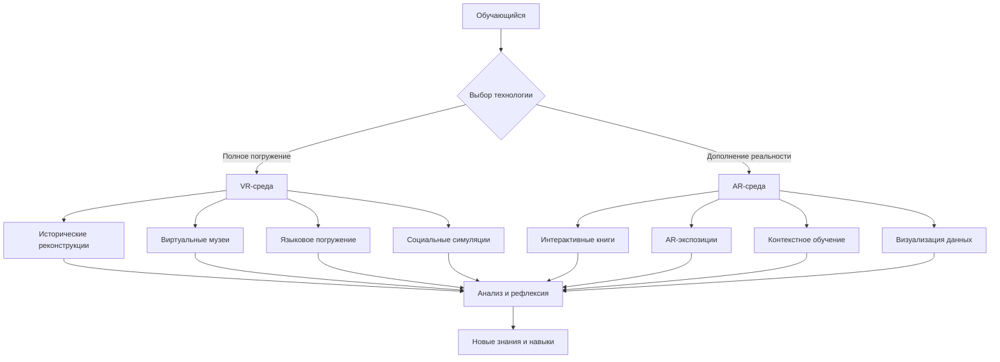

Современная педагогическая наука все больше обращается к технологиям иммерсивного обучения как к инструментам, способным преодолеть традиционные барьеры между теоретическими знаниями и практическим опытом. Особенно актуально это для гуманитарных дисциплин, где абстрактные концепции, исторические события и культурные феномены часто требуют не только интеллектуального понимания, но и эмоционального переживания.

## Применение VR и AR в гуманитарных исследованиях

### 1. Исторические исследования и культурология

Историческая наука переживает настоящую революцию благодаря технологиям виртуальной и дополненной реальности. Традиционные методы изучения прошлого, основанные на текстовых источниках, артефактах и иконографических материалах, дополняются возможностью буквально "побывать" в изучаемой эпохе.

- Виртуальные экскурсии позволяют студентам "прогуляться" по древним городам, таким как Древний Рим или Египет с его пирамидами, что превращает сухие исторические данные в эмоциональный опыт и улучшает усвоение материала.

- VR-фильм "1943 Berlin Blitz in 360°" переносит пользователя в реальное событие — ночной налет в Берлине во время Второй мировой войны.

- Виртуальные музеи (VR Museum of Fine Art) дают возможность изучать произведения искусства в деталях без физического ограничения и толпы.

### Процесс создания исторической VR-реконструкции

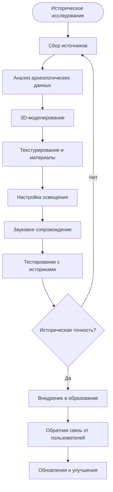

Особую ценность представляют проекты по восстановлению утраченных памятников архитектуры. Например, виртуальная реконструкция храма Пальмиры, разрушенного ИГИЛ, позволяет не только сохранить память о культурном наследии, но и изучать архитектурные особенности, недоступные ранее для массового изучения. Такие проекты требуют междисциплинарного подхода, объединяющего историков, археологов, архитекторов и IT-специалистов.

### 2. Изучение языков и межкультурная коммуникация

Лингводидактика получила мощный инструмент в виде иммерсивных технологий, которые позволяют создавать аутентичную языковую среду без необходимости физического перемещения в страну изучаемого языка. Это особенно важно в контексте глобализации образования и необходимости изучения множественных языков.

- AR-интерактивные карточки помогают изучению иностранных языков, совмещая визуальные и звуковые элементы для лучшего запоминания.
- Приложение Mondly создает иммерсивную языковую среду, где пользователи общаются с виртуальными носителями в различных жизненных ситуациях (кафе, улица).

- VR помогает погрузиться в языковую среду без необходимости выезда за границу.

### Уровни языкового погружения в VR/AR

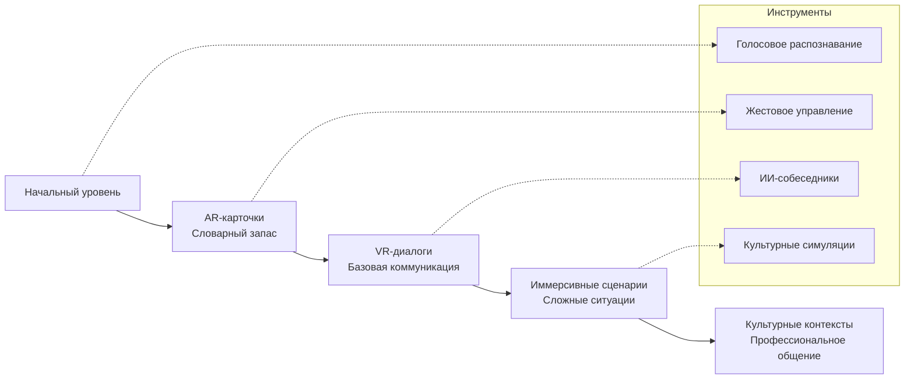

Современные VR-платформы для изучения языков используют технологии распознавания речи и искусственного интеллекта для создания адаптивных диалогов. Система анализирует произношение, грамматику и лексические выборы учащегося, предоставляя персонализированную обратную связь и корректировки в реальном времени.

### 3. Социальные науки и развитие эмпатии

Одним из наиболее перспективных направлений применения VR в гуманитарных науках является изучение социальных процессов и развитие эмпатии. Технология позволяет создавать контролируемые социальные эксперименты и ситуации, которые невозможно воспроизвести в реальных условиях по этическим или практическим соображениям.

- VR-технологии могут моделировать социальные ситуации, раскрывая опыт людей с ограниченными возможностями и развивая у людей эмпатию и социальную чувствительность.

### Модель развития эмпатии через VR-опыт

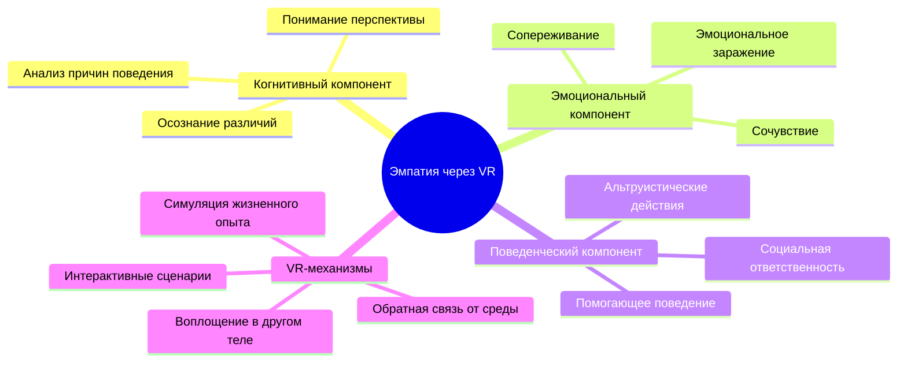

Исследования показывают, что VR-опыт воплощения в теле представителя другой социальной группы (например, пожилого человека, человека с инвалидностью, представителя другой расы) приводит к долгосрочным изменениям в установках и поведении участников. Это открывает новые возможности для борьбы с предрассудками и дискриминацией.

## Применение в образовании

### 1. Повышение вовлеченности и качества обучения

Традиционная образовательная модель, основанная на передаче информации от преподавателя к студенту, все больше уступает место интерактивным и персонализированным подходам. VR и AR технологии становятся катализаторами этой трансформации, предлагая принципиально новые способы взаимодействия с учебным материалом.

- VR и AR создают живой опыт обучения, где учащиеся могут "оказываться" внутри изучаемых объектов и процессов, например, внутри атома, архитектурных памятников или человеческого тела.
- Медицинские студенты в Кембриджском университете используют Microsoft HoloLens для тренировки на голограммах пациентов с различными симптомами.

### Сравнительная эффективность методов обучения

| Метод обучения | Уровень запоминания | Эмоциональная вовлеченность | Время усвоения | Стоимость реализации |
|----------------|---------------------|-----------------------------|-----------------|--------------------|
| Традиционная лекция | 20% | Низкая | Долгое | Низкая |
| Интерактивная презентация | 40% | Средняя | Среднее | Средняя |
| AR-визуализация | 65% | Высокая | Быстрое | Средняя |
| VR-погружение | 80% | Очень высокая | Очень быстрое | Высокая |
| Смешанный подход (VR+AR+традиционный) | 90% | Максимальная | Оптимальное | Высокая |

Нейропедагогические исследования подтверждают, что иммерсивный опыт активирует множественные сенорные каналы одновременно, что приводит к формированию более прочных нейронных связей и улучшению долгосрочной памяти. Кроме того, эмоциональная составляющая VR-опыта способствует выработке нейромедиаторов, усиливающих процессы обучения.

### 2. Индивидуализация обучения

Персонализированное образование становится не просто трендом, а необходимостью в условиях растущего разнообразия учебных потребностей и стилей обучения. VR и AR технологии предоставляют инструменты для создания адаптивных образовательных сред, которые подстраиваются под индивидуальные особенности каждого учащегося.

- Технологии поддерживают адаптацию учебного процесса под каждого ученика, позволяя повторять и тренировать навыки в безопасной, иммерсивной среде.

### Архитектура адаптивной VR-системы обучения

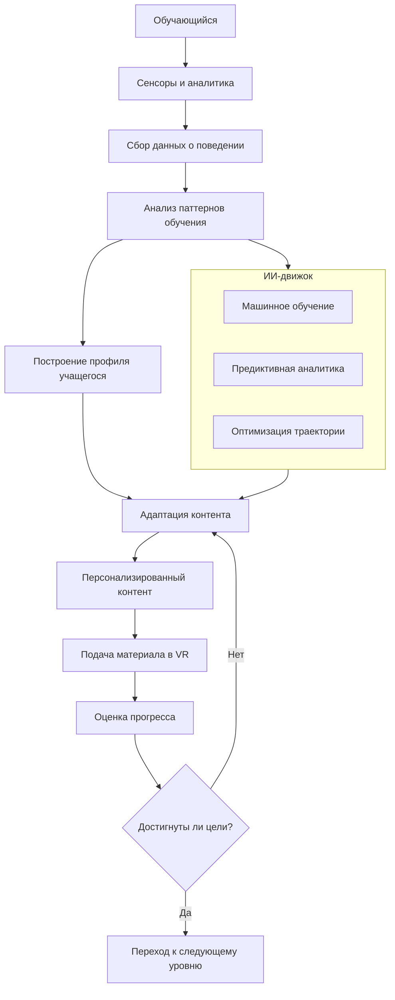

Современные адаптивные системы используют алгоритмы машинного обучения для анализа паттернов взаимодействия учащегося с VR-средой: время, проведенное на различных задачах, частота ошибок, предпочитаемые способы навигации, эмоциональные реакции (измеряемые через биометрические датчики). На основе этих данных система автоматически корректирует сложность материала, темп подачи информации и выбор оптимальных методов представления контента.

### 3. В корпоративном и дополнительном образовании

Корпоративное обучение переживает период активной трансформации, обусловленный необходимостью быстрой адаптации к изменяющимся технологиям и рабочим процессам. VR и AR становятся ключевыми инструментами для решения задач профессиональной подготовки и переквалификации.

- VR-сценарии для отработки действий в экстремальных ситуациях, таких как пожарные и полицейские тренировки.
- AR-инструкции для изучения использования сложного оборудования и технологий

### Типы корпоративного VR/AR обучения

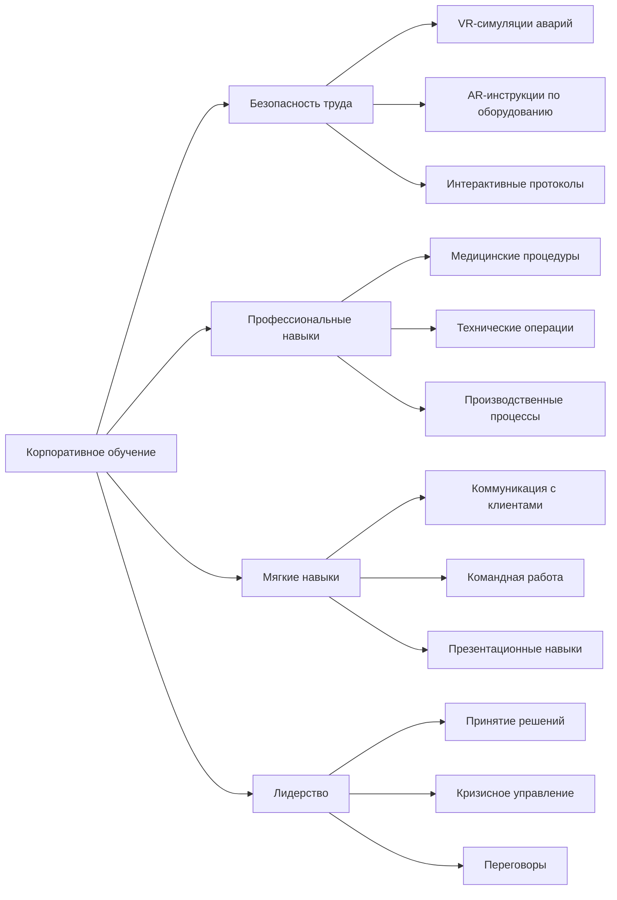

Экономическая эффективность VR-обучения особенно заметна в отраслях с высокими рисками. Например, обучение пилотов в VR-симуляторах обходится в десятки раз дешевле, чем использование реальных самолетов, при этом обеспечивая возможность отработки экстремальных сценариев, которые невозможно безопасно воспроизвести в реальности.

## Примеры проектной деятельности и геймификации

Геймификация образования через VR и AR технологии представляет собой мощный инструмент мотивации и вовлечения учащихся. Игровые механики, интегрированные в образовательный процесс, не только делают обучение более увлекательным, но и способствуют формированию устойчивых учебных привычек и развитию критического мышления.

- AR в книгах, например проект с цифровым главным героем Хохлик в книге «Заботы и забавы маленьких енисейцев»
- AR в музеях, например проект с цифровой рыбкой Джуно в Москвариуме, где QR-коды запускают интерактивный рассказ об обитателях, а по завершении — игровой тест на усвоение материала.

- Виртуальные лаборатории и учебные симуляторы используются для изучения биологии, истории, культуры и других гуманитарных дисциплин.

### Игровые механики в образовательных VR/AR приложениях

| Игровая механика | Применение в VR | Применение в AR | Образовательный эффект |
|------------------|-----------------|-----------------|----------------------|
| **Очки и уровни** | Прогресс в виртуальных мирах | Накопление знаний через AR-задания | Мотивация к продолжению обучения |
| **Достижения и бейджи** | Открытие новых локаций | Коллекционирование AR-объектов | Признание успехов и компетенций |
| **Квесты и миссии** | Исторические квесты | Поиск AR-объектов в реальном мире | Целенаправленное изучение материала |
| **Соревнования** | Многопользовательские VR-сценарии | AR-челленджи между учащимися | Социальное обучение и командная работа |
| **Нарративы** | Интерактивные VR-истории | AR-дополнения к реальным историям | Эмоциональная связь с материалом |
| **Исследование** | Открытые VR-миры | AR-слои в реальных локациях | Самостоятельное обучение и любознательность |

### Схема интеграции геймификации в образовательный процесс

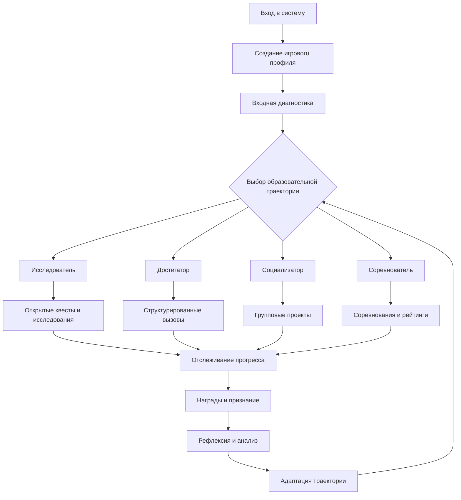

Важным аспектом является создание персистентного игрового мира, где достижения учащегося сохраняются и влияют на дальнейший образовательный опыт. Это формирует чувство владения и ответственности за свое обучение, что является ключевым фактором мотивации в долгосрочной перспективе.

## Технологические решения и инфраструктура

Успешное внедрение VR и AR в образование требует комплексного подхода к технологической инфраструктуре, включающего не только аппаратные решения, но и программные платформы, системы управления контентом и методики технической поддержки.

### Сравнительная характеристика VR/AR устройств для образования

| Устройство | Тип | Цена | Простота использования | Качество погружения | Мобильность | Рекомендуемое применение |
|------------|-----|------|----------------------|-------------------|-------------|------------------------|
| **Oculus Quest 2** | VR | $299 | Высокая | Отличное | Высокая | Индивидуальное обучение, языки |
| **HTC Vive Pro** | VR | $799 | Средняя | Превосходное | Низкая | Профессиональная подготовка |
| **Microsoft HoloLens 2** | AR | $3,500 | Средняя | Хорошее | Высокая | Корпоративное обучение |
| **Magic Leap 2** | AR | $2,295 | Средняя | Отличное | Высокая | Медицинское образование |
| **iPad Pro + LiDAR** | AR | $999 | Очень высокая | Хорошее | Очень высокая | Школьное образование |
| **Smartphone AR** | AR | $200-800 | Очень высокая | Среднее | Очень высокая | Массовое образование |

### Архитектура образовательной VR/AR платформы

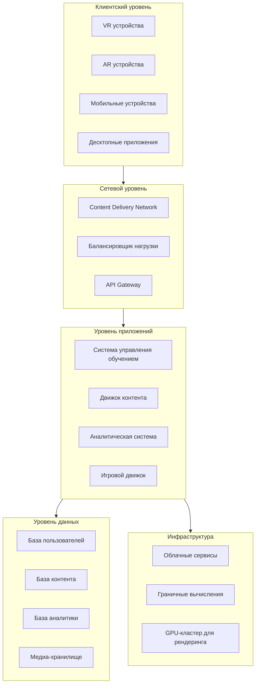

Критически важным является обеспечение низкой латентности для VR-приложений (менее 20 мс), что требует использования граничных вычислений и оптимизированных алгоритмов сжатия данных. Для AR-приложений ключевым фактором становится точность трекинга и стабильность наложения виртуальных объектов на реальную среду.

### Методологии разработки образовательного VR/AR контента

Создание качественного образовательного контента для иммерсивных технологий требует междисциплинарного подхода, объединяющего экспертизу в области педагогики, предметных областей, дизайна пользовательского опыта и технической разработки.

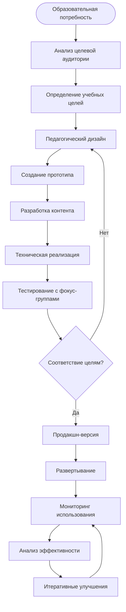

Особое внимание уделяется принципам универсального дизайна, обеспечивающим доступность контента для учащихся с различными потребностями, включая студентов с ограниченными возможностями. Это включает поддержку альтернативных способов навигации, субтитров, тактильной обратной связи и адаптивных интерфейсов.

## Преимущества и недостатки

### Детальный анализ преимуществ

**Преимущества:**

Повышение вовлечённости и мотивации учеников является одним из наиболее значимых преимуществ иммерсивных технологий. Исследования показывают, что студенты, использующие VR/AR в обучении, демонстрируют на 30-40% более высокий уровень вовлеченности по сравнению с традиционными методами. Это связано с активацией множественных сенсорных каналов и созданием эмоционально значимого опыта.

- Повышение вовлечённости и мотивации учеников.
- Возможность практиковать навыки в безопасной и контролируемой среде.
- Персонализация обучения под индивидуальные потребности студентов.
- Доступ к недоступным физически местам и материалам

Безопасная практическая среда особенно важна для профессиональной подготовки в областях с высоким риском. Медицинские студенты могут отрабатывать хирургические процедуры без риска для пациентов, будущие пилоты — управление в экстремальных ситуациях, а историки — проводить "раскопки" в виртуальных археологических слоях без риска повреждения реальных артефактов.

### Анализ проблем и ограничений

**Недостатки:**

Высокая стоимость является серьезным барьером для широкого внедрения технологий. Помимо первоначальных затрат на оборудование, необходимо учитывать расходы на разработку контента, обучение преподавателей, техническую поддержку и регулярные обновления. Для образовательных учреждений это может составлять значительную нагрузку на бюджет.

- Высокая стоимость оборудования и разработки контента.
- Необходимость адаптации учебных программ и подготовки преподавателей.
- Возможные технические сложности и ограниченность в доступности технологий.

### Сравнительный анализ затрат и выгод

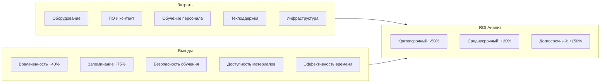

### Барьеры внедрения и стратегии их преодоления

| Барьер | Описание проблемы | Стратегия преодоления | Временные рамки |
|--------|-------------------|----------------------|-----------------|
| **Финансовый** | Высокие первоначальные инвестиции | Поэтапное внедрение, лизинг оборудования, гранты | 1-3 года |
| **Технологический** | Сложность интеграции с существующими системами | Использование облачных решений, стандартизация | 6-12 месяцев |
| **Педагогический** | Сопротивление изменениям со стороны преподавателей | Программы повышения квалификации, демонстрация успешных кейсов | 1-2 года |
| **Организационный** | Отсутствие четкой стратегии внедрения | Создание рабочих групп, пилотные проекты | 6-18 месяцев |
| **Культурный** | Скептицизм относительно эффективности технологий | Измерение и демонстрация образовательных результатов | 2-3 года |

## Психолого-педагогические аспекты

Внедрение VR и AR в образование требует глубокого понимания психологических механизмов обучения и возрастных особенностей учащихся. Различные возрастные группы по-разному воспринимают иммерсивный опыт и требуют соответствующей адаптации контента и методик.

### Возрастные особенности использования VR/AR в образовании

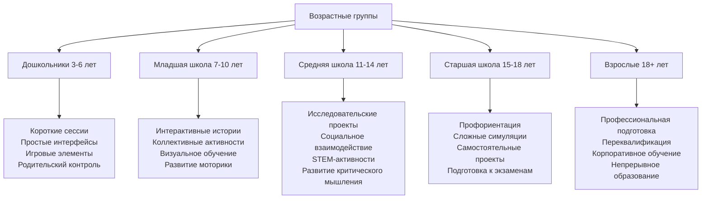

Особого внимания требуют вопросы кибербезопасности и цифрового благополучия учащихся. Длительное использование VR может вызывать усталость глаз, дезориентацию и в редких случаях — симптомы киберболезни. Для минимизации этих рисков рекомендуется ограничивать продолжительность VR-сессий (15-20 минут для детей, 30-45 минут для взрослых) и включать регулярные перерывы.

### Когнитивная нагрузка и дизайн интерфейса

Теория когнитивной нагрузки играет ключевую роль в разработке эффективных образовательных VR/AR приложений. Необходимо тщательно балансировать между иммерсивностью и когнитивной доступностью, избегая перегрузки учащегося излишней информацией или сложными интерфейсами.

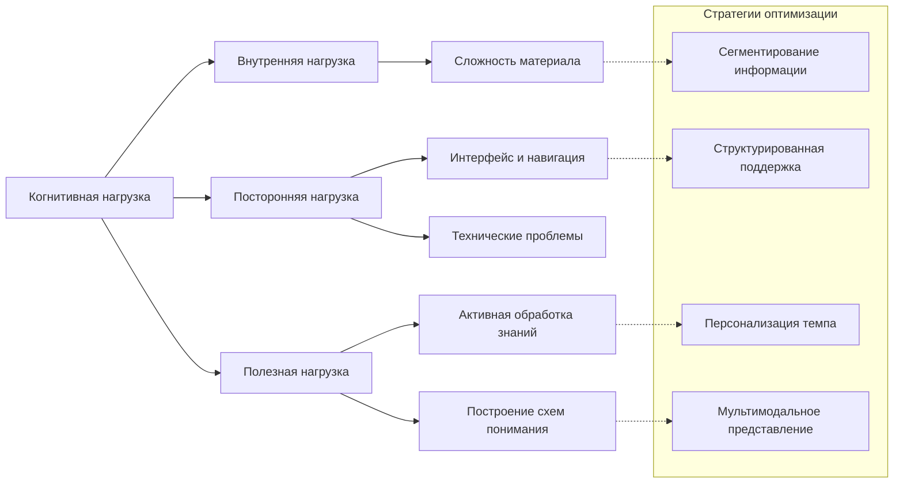

## Этические аспекты и приватность

Использование иммерсивных технологий в образовании поднимает важные этические вопросы, связанные с приватностью данных, психологическим воздействием и равенством доступа к образовательным ресурсам.

### Этические принципы использования VR/AR в образовании

| Принцип | Описание | Практические меры |
|---------|----------|-------------------|
| **Информированное согласие** | Учащиеся и их родители должны понимать, какие данные собираются и как используются | Ясная политика конфиденциальности, обучающие материалы |
| **Минимизация данных** | Сбор только необходимых для образовательных целей данных | Регулярный аудит собираемой информации |
| **Прозрачность алгоритмов** | Понятность принципов работы ИИ-систем персонализации | Документирование алгоритмов, возможность контроля пользователем |
| **Равенство доступа** | Предотвращение цифрового разрыва | Программы финансовой поддержки, альтернативные решения |
| **Психологическая безопасность** | Защита от потенциально травмирующего контента | Возрастная классификация, фильтры контента, поддержка специалистов |

### Модель защиты данных в образовательных VR/AR системах

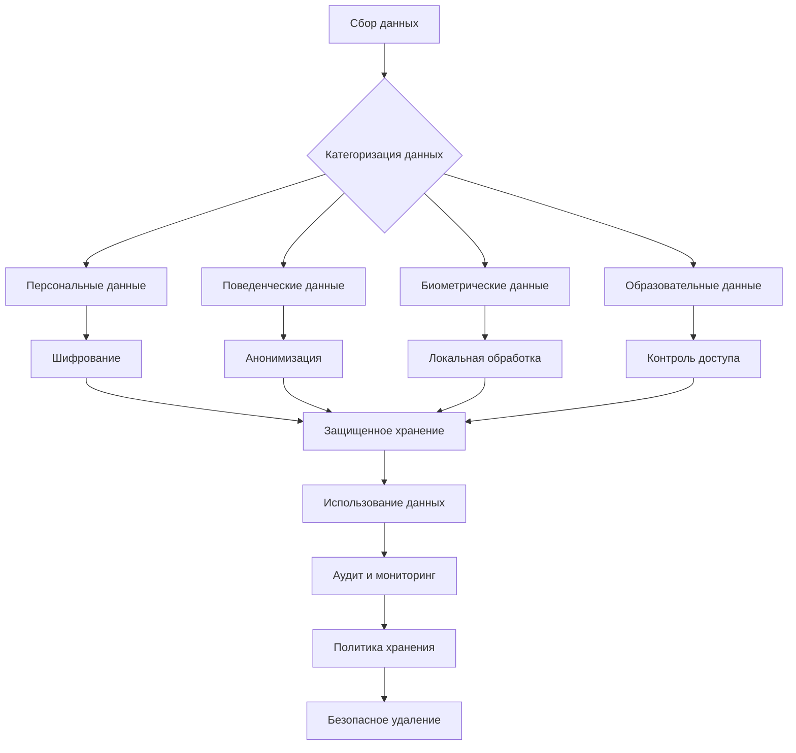

## Заключение

VR и AR трансформируют гуманитарное образование, создавая уникальные возможности для глубокого, интерактивного и персонализированного обучения. Примеры успешных кейсов в разных областях подтверждают эффективность этих технологий, способствуя развитию новых педагогических и исследовательских практик.

Однако успешное внедрение иммерсивных технологий требует системного подхода, включающего не только технологические решения, но и изменения в педагогических методиках, подготовку преподавательского состава, обеспечение равного доступа к образовательным ресурсам и соблюдение этических принципов.

Будущее гуманитарного образования видится в интеграции традиционных и иммерсивных методов обучения, где технологии VR и AR становятся инструментами для создания более вовлекающего, персонализированного и эффективного образовательного опыта. Ключевым фактором успеха станет не сама технология, а её грамотное применение в контексте педагогических целей и потребностей учащихся.

### Прогноз развития VR/AR в гуманитарном образовании

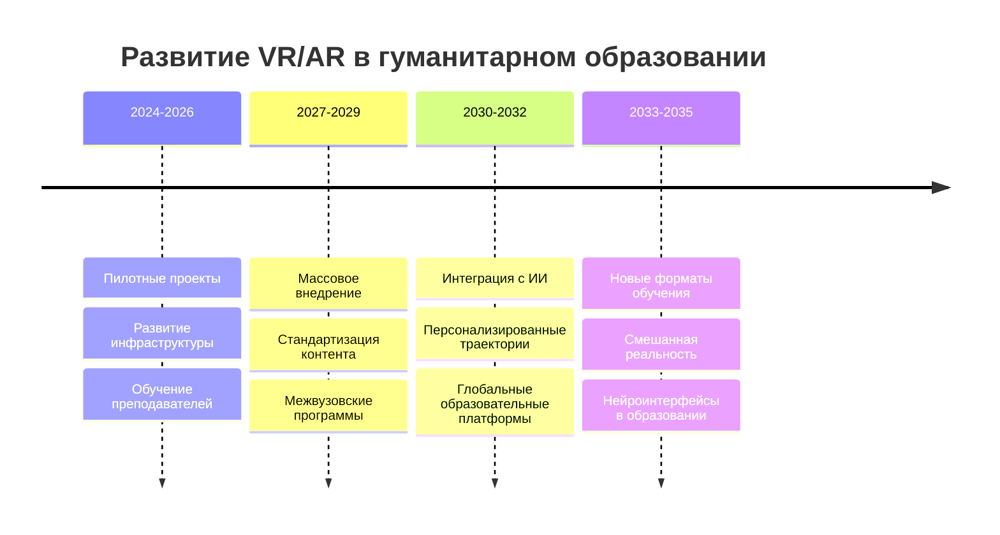

Конечной целью является создание образовательной экосистемы, где границы между физическим и цифровым мирами стираются, предоставляя учащимся безграничные возможности для исследования, творчества и личностного развития в контексте гуманитарных наук.
