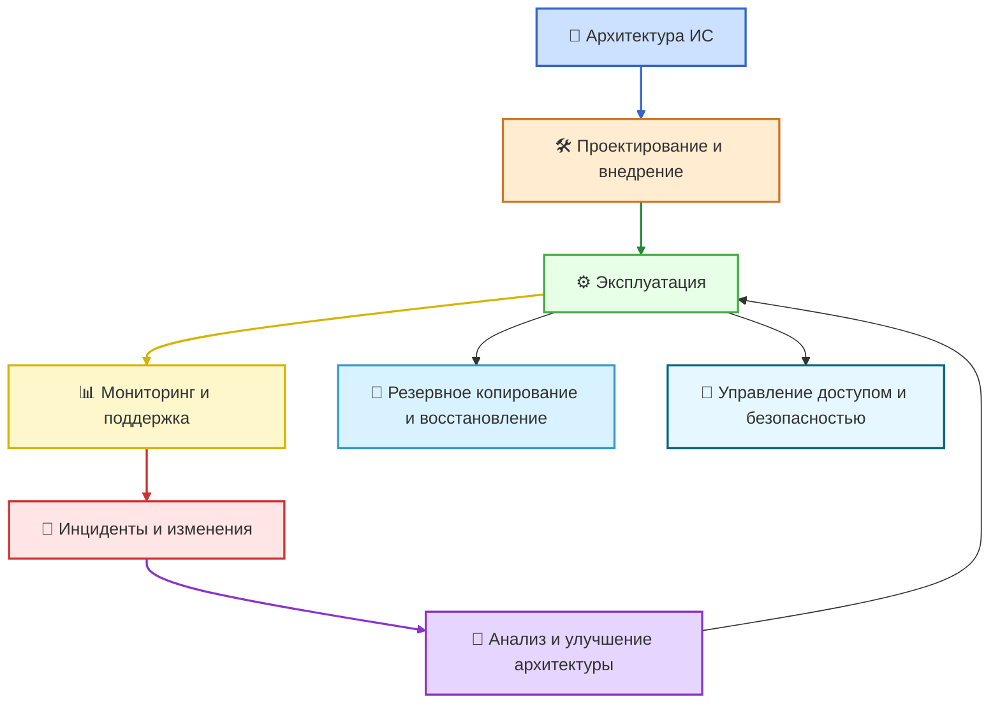

## Введение

Информационная система (ИС) – это совокупность людей, процессов, программ и технических средств, которые вместе обеспечивают сбор, хранение, обработку и передачу информации. Архитектура ИС задаёт, как эти компоненты связаны между собой, а системное администрирование отвечает за то, чтобы всё это реально и устойчиво работало каждый день.

Задача доклада – показать, какие основные функции выполняет системный администратор и какие мероприятия обеспечивают поддержание работоспособности ИС на практике.

## Цели системного администрирования

Главные цели администрирования:

* **Доступность**: системы работают тогда, когда нужны пользователю.
* **Надёжность и целостность данных**: данные не теряются и не повреждаются.
* **Безопасность**: несанкционированный доступ и утечки минимизируются.
* **Производительность**: ресурсы используются эффективно, без «тормозов».
* **Управляемость и масштабируемость**: ИС можно развивать без хаоса и аварий.

## Место системного администрирования в архитектуре ИС

Архитектуру ИС условно делят на уровни:

* аппаратный (серверы, СХД, сеть, инженерная инфраструктура);
* системный (ОС, гипервизоры, СУБД, сервисы каталогов);
* прикладной (бизнес-приложения, веб-сервисы);
* пользовательский (АРМ сотрудников, мобильные клиенты, браузеры).

Системный администратор действует на стыке этих уровней: он разворачивает и настраивает компоненты, контролирует их взаимодействие, а также обеспечивает их поддержку в штатных и аварийных ситуациях.
## Обзор основных блоков задач системного администратора

Крупные группы задач:

* управление инфраструктурой (серверы, сети, хранилища);
* управление пользователями и правами доступа;
* обеспечение информационной безопасности;
* резервное копирование и восстановление;
* мониторинг, диагностика и работа с инцидентами;
* профилактика и поддержание работоспособности;
* документирование и взаимодействие с пользователями и руководством.

## Схематичное место администрирования в жизненном цикле ИС

## 1. Управление инфраструктурой ИС

Сюда входят:

* установка и конфигурация серверов, сетевого оборудования, систем хранения;
* развёртывание и обновление операционных систем, гипервизоров, баз данных;
* планирование ресурсов (CPU, RAM, диски, сеть) с запасом под рост нагрузки;
* управление инженерной инфраструктурой: питание, климат-контроль, пожаротушение, охранно-пожарная сигнализация.

Практический смысл: без корректно настроенной инфраструктуры даже идеальное ПО будет работать нестабильно или вообще не запустится.

## 2. Управление пользователями и правами доступа

Это уровень, на котором администратор сталкивается с пользователями напрямую. Основные задачи:

* создание, изменение и удаление учётных записей;
* назначение и периодический пересмотр прав доступа по принципу *минимально необходимого*;
* управление группами и ролями в домене, приложениях, СУБД;
* контроль корректности увольнения/перевода сотрудников (оперативное отключение доступа).

Практический смысл: правильные права снижают риск утечек, случайных удалений и саботажа, а также упрощают аудит.

## 3. Обеспечение информационной безопасности

Часть задач пересекается с предыдущим пунктом, но безопасность выходит за рамки одних только прав доступа. Основные действия:

* установка и своевременное обновление патчей безопасности ОС и приложений;
* сегментация сети и ограничение доступа к критическим серверам;
* ведение и анализ журналов безопасности (логов) для выявления аномалий;
* участие в расследовании инцидентов ИБ и выполнении регламентов (инструкции при кризисных ситуациях).

Практический смысл: защита ИС строится не только на политике, но и на ежедневных рутинных действиях администратора. Ошибки на этом уровне ведут к утечкам, простоям и прямым финансовым потерям.

## 4. Резервное копирование и восстановление

Резервное копирование – основное средство защиты от потери данных из-за ошибок пользователей, сбоев оборудования, атак (например, шифровальщиков) или катастроф.

Задачи администратора:

* определить, что именно и как часто нужно копировать (критичные базы, файлы, конфигурации);
* выбрать стратегию: полные, инкрементные, дифференциальные и образ диска (image-backup);
* реализовать правило **3-2-1**: минимум 3 копии данных, 2 разных типа носителей, 1 копия вне площадки;
* обеспечить защиту резервных копий (шифрование, контроль доступа, «immutable»-хранилища);
* регулярно **тестировать восстановление** – иначе резервные копии могут оказаться непригодными.

Практический смысл: наличие проверенной схемы backup & restore позволяет вернуться к работе после серьёзных сбоев, а также уменьшает последствия ошибок администраторов и пользователей.

## 5. Мониторинг, диагностика и управление инцидентами

### Мониторинг и диагностика

* постоянный контроль состояния серверов, СУБД, сетей, приложений (нагрузка, отклик, доступность);
* централизованный сбор логов и алертов;
* выявление отклонений до того, как пользователи заметят проблему.

### Инциденты, проблемы и изменения

В современных подходах (например, ITIL) различают:

* **Инцидент** – неожиданный сбой или ухудшение качества ИТ-сервиса (например, недоступна учётная система).
* **Проблема** – корневая причина одного или нескольких инцидентов (ошибка конфигурации, дефект ПО, неисправность оборудования).
* **Изменение** – планируемое действие, которое вносит правки в конфигурацию системы (обновление версии, миграция, переразвёртывание).

Роль администратора:

1. быстро зафиксировать и классифицировать инцидент;
2. восстановить сервис (пусть временным обходным решением);
3. участвовать в анализе причин и планировании изменений, чтобы инцидент не повторялся;
4. аккуратно реализовать изменения, минимизируя простои.

Практический смысл: без разделения «чиню прямо сейчас» и «исправляю причину навсегда» организация постоянно живёт в режиме тушения пожаров.

## 6. Поддержание работоспособности и профилактика

В учебной и нормативной литературе подчёркивается, что именно рутинные действия по поддержанию работоспособности часто являются наиболее опасной зоной: человеческие ошибки могут привести к повреждению аппаратуры, разрушению программ и данных или созданию брешей в защите.

К типовым мероприятиям относятся:

* регламентные перезагрузки и обслуживание;
* проверка целостности файлов и баз данных;
* очистка временных файлов и старых учётных записей;
* контроль параметров среды (питание, температура, влажность);
* плановая замена оборудования, выходящего за пределы ресурса.

### Сравнение профилактики и реакции на сбой

| Подход          | Что делает администратор                            | Результат для ИС                                             |
| --------------- | --------------------------------------------------- | ------------------------------------------------------------ |
| Профилактика    | плановые проверки, обновления, тесты восстановления | меньше аварий, быстрее восстановление, прогнозируемая работа |
| Реакция на сбой | устранение конкретной поломки «здесь и сейчас»      | восстановление работы, но риск повторения той же проблемы    |

## 7. Документирование и взаимодействие

Для устойчивой работы ИС важны не только технические навыки администратора, но и правильное оформление знаний:

* ведение документации по архитектуре, конфигурации и изменениям;
* создание эксплуатационных регламентов, инструкций для пользователей;
* фиксация инцидентов и решений в базе знаний;
* обучение сотрудников базовым правилам работы с ИС (пароли, файлы, почта).

Практический смысл: если знания остаются только «в голове администратора», любая его ошибка, увольнение или отпуск превращаются в риск для бизнеса.

## 8. Вклад системного администрирования в развитие архитектуры ИС

Системный администратор не только обслуживает текущую ИС, но и влияет на её архитектурное развитие:
* участвует в выборе платформ (on-premises, облако, гибрид);
* предлагает стандартизацию технологий (единые версии ОС, СУБД, средств мониторинга);
* оценивает риски и трудозатраты на новые решения (виртуализация, контейнеризация, микросервисы);
* планирует миграции и модернизации с учётом обратной совместимости и времени простоя.

Практический смысл: грамотное администрирование связывает «идеальную» архитектуру с тем, что реально можно внедрить и поддерживать ограниченными ресурсами.

## Краткий вывод

Системное администрирование – это комплекс практических действий, который делает архитектуру информационной системы жизнеспособной в реальных условиях.

Основные задачи администратора:

* поддерживать инфраструктуру ИС в рабочем состоянии;
* управлять пользователями и доступом, соблюдая принципы безопасности;
* организовать надёжное резервное копирование и восстановление;
* постоянно мониторить состояние ИС, оперативно обрабатывать инциденты и устранять их причины;
* проводить профилактику и минимизировать риски человеческих ошибок;
* документировать архитектуру и процессы, а также участвовать в развитии ИС.

Именно качественная ежедневная работа администратора обеспечивает для организации привычную вещь – «всё просто работает», несмотря на сложность современной архитектуры информационных систем.

## Источники

1.Quicksupport.ie. System Administration Services for Optimal IT Management (база).
2.Учебные материалы по административному и процедурному уровням обеспечения информационной безопасности и поддержанию работоспособности информационных систем. Электронные конспекты и методические разработки на образовательных порталах (Studfile, Infourok)
3.Материалы по ITSM/ITIL (incident, problem, change management). Обзоры и практические руководства компаний ManageEngine, Atlassian.
4.Статьи о резервном копировании и восстановлении данных. Публикации компаний Veeam, Bacula Systems, ObjectFirst.
