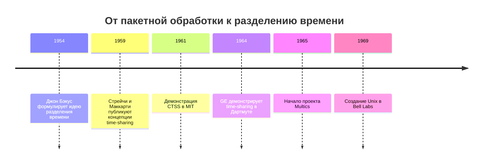
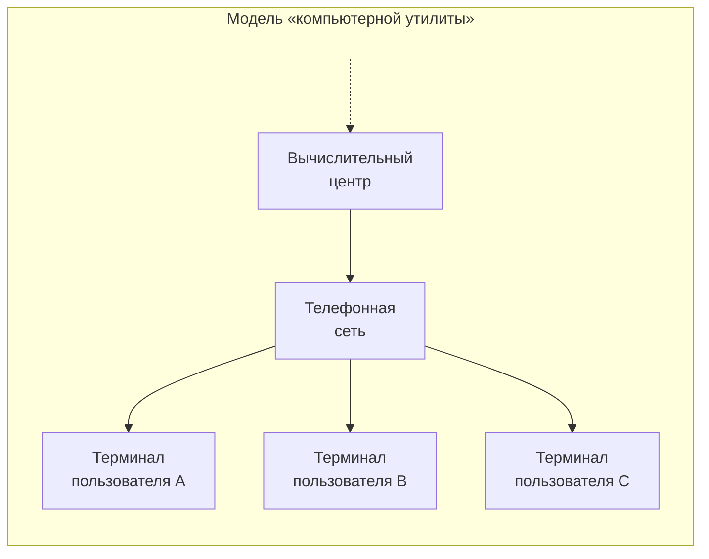
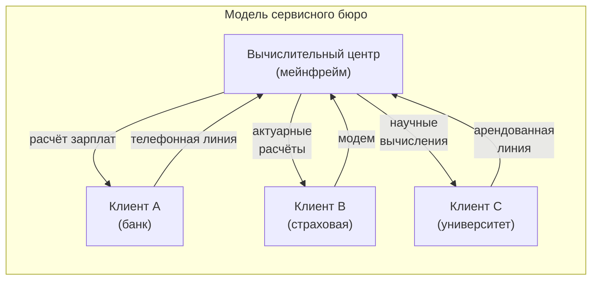
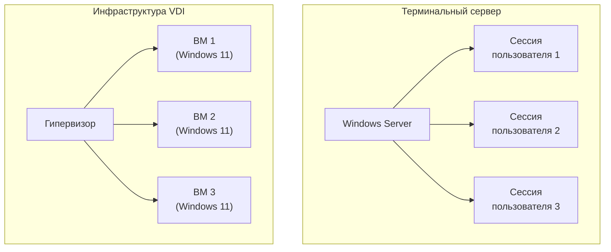

# Основы многопользовательских и многозадачных вычислений.

## От пакетной обработки к интерактивным вычислениям

В 1950-х годах компьютеры были чрезвычайно дорогими устройствами, и основной моделью их использования служила **пакетная обработка** (batch processing). Пользователь готовил задание на перфокартах, передавал его оператору, а результаты получал спустя часы или даже дни в виде распечатки. Компьютер обрабатывал задания последовательно, без какого-либо взаимодействия с пользователем в реальном времени.

Такой режим работы создавал серьёзные неудобства. Программист, обнаружив ошибку в результатах, должен был заново готовить перфокарты и ждать следующего «окна» для запуска. Цикл разработки растягивался на дни. Одновременно сам компьютер простаивал значительную часть времени: пока считывались перфокарты или печатались результаты, процессор бездействовал.

Осознание этих проблем привело к поиску альтернативных подходов. В 1954 году Джон Бэкус на летней сессии MIT высказал идею: «Большой компьютер мог бы использоваться как несколько маленьких; потребовалась бы станция чтения для каждого пользователя». В 1959 году британский математик Кристофер Стрейчи представил концепцию разделения времени на конгрессе ЮНЕСКО, а Джон Маккарти независимо развивал аналогичные идеи в MIT.

---

## Концепция «компьютерной утилиты»

Пионеры разделения времени рассматривали компьютер не просто как машину для вычислений, а как **инфраструктурный сервис**, подобный электричеству или водоснабжению. Эта идея получила название **«компьютерная утилита»** (computer utility).

В 1966 году доктор Мэнли Ирвин писал: «В течение следующего десятилетия электронные вычислительные центры, как ожидается, будут продавать вычислительную мощность широкой публике способом, в чём-то аналогичным сегодняшнему распределению электроэнергии». Пользователь должен был получать доступ к вычислениям так же просто, как включает лампочку — не задумываясь о том, где находится электростанция и как устроена электросеть.

Проект **Multics** (Multiplexed Information and Computing Service), стартовавший в 1965 году как совместная инициатива MIT, Bell Labs и General Electric, был наиболее амбициозной попыткой воплотить эту концепцию. Multics проектировался как система, способная непрерывно работать годами, обслуживая тысячи пользователей. Название буквально означало «мультиплексированный информационный и вычислительный сервис» — акцент делался именно на предоставлении услуги, а не на технических деталях реализации.

Хотя Multics не достиг коммерческого успеха, его идеи оказались пророческими. Последняя система Multics была отключена в 2000 году — к этому времени концепция «компьютерной утилиты» уже возрождалась в форме облачных вычислений.

---

## Терминалы, модемы и удалённый доступ

Разделение времени стало возможным благодаря развитию технологий удалённого доступа. Ключевым элементом была связка **терминал + линия связи + центральный компьютер**.

Первыми терминалами служили электромеханические телетайпы — устройства, изначально предназначенные для телеграфной связи. Модель **Teletype Model 33 ASR** стала де-факто стандартом для систем разделения времени 1960-х годов. Она печатала со скоростью 10 символов в секунду и могла работать с перфолентой для хранения программ. С 1970-х годов телетайпы постепенно вытеснялись дисплейными терминалами (CRT), такими как DEC VT05, Datapoint 2200 и Lear Siegler ADM-3A.

Для связи терминалов с компьютером использовались различные каналы. Терминалы в одном здании подключались через последовательные кабели или токовые петли. Для удалённого доступа применялись арендованные телефонные линии и **модемы** — устройства, преобразующие цифровые сигналы в аналоговые для передачи по обычной телефонной сети. Модем Bell 103, выпущенный в 1962 году, обеспечивал скорость 300 бит/с и позволял пользователям из любой точки страны подключаться к центральному компьютеру.

Система **CTSS** (Compatible Time-Sharing System), продемонстрированная в MIT в ноябре 1961 года, изначально поддерживала четырёх пользователей. К 1963 году она обслуживала уже 30 одновременных пользователей, часть из которых работала удалённо через модемы. Для пользователей того времени это было революционным опытом: вместо ожидания результатов пакетного задания они могли мгновенно видеть отклик системы на свои команды.

---

## Многозадачность и многопользовательность: разграничение понятий

Хотя термины часто используются вместе, они описывают разные аспекты работы вычислительной системы.

**Многозадачность** (multitasking) — способность системы выполнять несколько задач (программ) в перекрывающиеся периоды времени. Это техническая характеристика, относящаяся к организации вычислительного процесса. Многозадачность может существовать в однопользовательской системе: например, на персональном компьютере пользователь одновременно слушает музыку, редактирует документ и загружает файл из интернета.

**Многопользовательность** (multiuser capability) — возможность системы обслуживать нескольких независимых пользователей одновременно, предоставляя каждому изолированную рабочую среду. Многопользовательская система обязательно является многозадачной, но обратное неверно.

| Тип системы | Многозадачность | Многопользовательность | Примеры |
|-------------|-----------------|------------------------|---------|
| Пакетная (1950-е) | Нет | Нет | Ранние IBM, UNIVAC |
| Многопрограммная | Да | Нет | OS/360 MFT |
| Однопользовательская ПК | Да | Нет | Windows 95, MS-DOS с оболочкой |
| Time-sharing | Да | Да | CTSS, Multics, Unix |
| Современные серверные ОС | Да | Да | Linux, Windows Server |

Классические примеры многопользовательских систем: Unix и его производные, OpenVMS, Multics, VM/CMS. Система позволяет множеству пользователей входить через локальные или удалённые терминалы (сегодня — через SSH, Remote Desktop), при этом каждый пользователь работает в своей изолированной среде со своими файлами, настройками и запущенными программами.

---

## Сервисные бюро: первый бизнес на разделении времени

С развитием систем разделения времени в 1960-х годах появилась новая бизнес-модель — **сервисные бюро** (service bureaus, computer bureaus). Эти компании приобретали дорогостоящие компьютеры и продавали вычислительное время клиентам.

Одним из пионеров была компания **ADP** (Automatic Data Processing). Основанная в 1949 году как Automatic Payrolls Inc., она начинала с обработки платёжных ведомостей на счётных машинах. В 1961 году ADP приобрела компьютер IBM 1401 и стала использовать телекоммуникации для удалённого сбора данных от клиентов.

К 1966 году в США работало около 800 сервисных бюро с совокупным оборотом 650 миллионов долларов и темпами роста 40% в год. Крупнейшими игроками стали General Electric, Timeshare Inc. и CDC. Они строили глобальные вычислительные центры, обслуживавшие тысячи пользователей.

Модель сервисных бюро имела очевидные преимущества: клиенты получали доступ к мощным компьютерам без необходимости покупать и обслуживать собственное оборудование. Бюро обеспечивало техническую поддержку, разрабатывало типовые программы (например, для расчёта зарплат или бухгалтерского учёта) и продавало их множеству клиентов.

С появлением персональных компьютеров в 1980-х годах классические сервисные бюро утратили актуальность. Однако сама модель «вычисления как услуги» возродилась в XXI веке в форме облачных сервисов.

---

## Облачные технологии как наследники time-sharing

Современные облачные вычисления удивительно похожи на системы разделения времени 1960-х годов — с поправкой на масштаб и технологии.

**SaaS** (Software as a Service) — модель, при которой программное обеспечение размещается в облаке и доступно множеству пользователей через интернет. Пользователь не устанавливает программу на свой компьютер, а работает с ней через браузер или тонкий клиент. Провайдер отвечает за инфраструктуру, обновления и безопасность.

Параллели с time-sharing очевидны:
- Пользователи не владеют оборудованием, на котором выполняются их программы
- Вычислительные ресурсы разделяются между многими клиентами
- Доступ осуществляется через сеть (тогда — телефонную, сейчас — интернет)
- Оплата за фактическое использование, а не за владение

Ключевой архитектурный принцип современных облачных сервисов — **мультитенантность** (multi-tenancy). Один экземпляр приложения обслуживает множество клиентов («арендаторов»), данные которых логически изолированы друг от друга. Это позволяет провайдеру эффективно использовать ресурсы и предлагать услуги по низкой цене, сохраняя при этом приватность данных каждого клиента.

| Характеристика | Time-sharing (1960–70-е) | Облачные сервисы (2010–20-е) |
|----------------|--------------------------|------------------------------|
| Доступ | Телетайп/терминал через модем | Браузер/приложение через интернет |
| Инфраструктура | Мейнфрейм в вычислительном центре | Дата-центры по всему миру |
| Модель оплаты | За процессорное время | За использование (подписка, pay-as-you-go) |
| Изоляция пользователей | На уровне ОС (учётные записи) | Логическая изоляция + виртуализация |
| Масштаб | Сотни пользователей | Миллионы пользователей |

---

## Терминальные серверы и VDI

Между классическими системами разделения времени и современными облачными сервисами существует промежуточное звено — **терминальные серверы** и **инфраструктура виртуальных рабочих столов** (VDI).

**Терминальный сервер** — сервер, на котором выполняются пользовательские приложения, а клиентские устройства отображают только графический интерфейс. Microsoft представила Windows NT 4.0 Terminal Server Edition в 1997 году, позволив множеству пользователей одновременно работать с Windows-приложениями на центральном сервере.

В современной терминологии Microsoft эта технология называется **Remote Desktop Services** (ранее — Terminal Services). Архитектура включает:
- **RD Session Host** — сервер, на котором выполняются сессии пользователей
- **RD Connection Broker** — распределяет подключения между серверами
- **RD Gateway** — обеспечивает безопасный доступ через интернет
- **RD Web Access** — веб-портал для доступа к приложениям

**VDI** (Virtual Desktop Infrastructure) — технология, при которой каждому пользователю выделяется отдельная виртуальная машина с полноценной операционной системой. В отличие от терминального сервера, где все пользователи работают в рамках одной ОС, VDI обеспечивает полную изоляцию рабочих сред.

Выбор между терминальным сервером и VDI зависит от требований:

| Критерий | Терминальный сервер | VDI |
|----------|--------------------|----|
| Изоляция | Сессии в рамках одной ОС | Отдельные виртуальные машины |
| Ресурсы | Более экономное использование | Выше потребление памяти и CPU |
| Совместимость | Требуется совместимость приложений с многопользовательским режимом | Любые приложения |
| Персонализация | Ограниченная | Полная (свой рабочий стол) |
| Стоимость | Ниже | Выше |

Оба подхода продолжают традицию многопользовательских вычислений: пользователи работают с удалённым сервером через сеть, а вычисления выполняются централизованно. При этом они наследуют как преимущества (централизованное управление, безопасность данных, доступ с любого устройства), так и ограничения (зависимость от сети, задержки при передаче графики) классических систем разделения времени.

---

## Заключение

Многопользовательские и многозадачные вычисления прошли путь от экспериментальных систем 1960-х годов до глобальной облачной инфраструктуры современности. Концепция «компьютерной утилиты», сформулированная пионерами Multics, реализована в современных SaaS-сервисах. Терминальные серверы и VDI продолжают традицию централизованных вычислений в корпоративной среде.

Ключевые принципы остаются неизменными: эффективное разделение ресурсов между пользователями, изоляция рабочих сред, доступ через сеть, модель «вычисления как услуги». Меняются лишь технологии реализации и масштаб применения.

---
