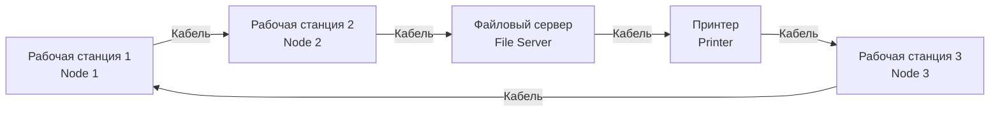
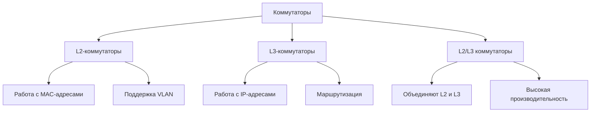

# Организация и назначение локальных и глобальных сетей

## Введение

В современном мире информационные технологии пронизывают все сферы жизни общества и экономики. Фундаментом этой цифровой трансформации являются компьютерные сети, которые позволяют объединять вычислительные ресурсы, данные и пользователей. Наиболее распространёнными и значимыми типами сетей являются локальные **(LAN)** и глобальные **(WAN)** сети.

## 1. Локальные вычислительные сети (LAN)

### 1.1. Определение и организация

**Локальная вычислительная сеть (Local Area Network, LAN)** — это сеть, ограниченная небольшим географическим пространством. Объединяют относительно небольшое число компьютеров (10 – 100) в пределах одного помещения (учебный компьютерный класс), здания или учреждения (университета). Раньше использовались в основном для решения вычислительных задач, сейчас в 99% случаев используются для обмена информацией. Причем от 60% до 90% информации циркулирует внутри LAN, не нуждаясь в выходе наружу. 

**LAN в зависимости от назначения и технических решений могут иметь различную конфигурацию (архитектуру, топологию):**

* Кольцевая LAN - информация передается по замкнутому каналу. Каждый абонент непосредственно связан с двумя ближайшими соседями, хотя в принципе способен связаться с любым абонентом сети.

* Звездообразная LAN - в центре находится центральный управляющий компьютер, последовательно связывающийся с абонентами и связывающий их друг с другом.
 ```mermaid
graph TD
    subgraph "Классическая звездообразная сеть"
        ЦК[Центральный<br/>компьютер]
        
        ЦК -->|Канал 1| А1[Абонент A]
        ЦК -->|Канал 2| А2[Абонент B]
        ЦК -->|Канал 3| А3[Абонент C]
        ЦК -->|Канал 4| А4[Абонент D]
    end
```
* Шинная LAN - компьютеры подключены к общему для них каналу (шине), через который могут обмениваться сообщениями.
 ```mermaid
graph LR
B[==============================================================================]
B --- C1[Компьютер 1]
B --- C2[Компьютер 2]
B --- C3[Компьютер 3]
B --- C4[Компьютер 4]
```
* Древовидная LAN - существует «главный» компьютер, которому подчинены компьютеры следующего уровня и т.д.
 ```mermaid
graph TD
    Г[Главный]
    
    Г --> A[Компьютер A]
    Г --> B[Компьютер B]
    Г --> C[Компьютер C]
    
    A --> A1[Подчиненный A1]
    A --> A2[Подчиненный A2]
    
    B --> B1[Подчиненный B1]
    B --> B2[Подчиненный B2]
    B --> B3[Подчиненный B3]
    
    A1 --> A11[Рабочая станция]
    A1 --> A12[Рабочая станция]
```
* Полносвязная LAN - каждый компьютер в сети связан с любым другим компьютером в сети.
 ```mermaid
graph TD
    subgraph "Полносвязная сеть"
        A[ПК A] --- B[ПК B]
        A --- C[ПК C]
        A --- D[ПК D]
        B --- C
        B --- D
        C --- D
    end
```
**Организация LAN:**

*   **Коммутаторы (Switch):** Интеллектуальные устройства, анализирующие MAC-адреса и передающие данные только целевому узлу.

    
*   **Маршрутизаторы (Router):** На границе LAN обеспечивают связь с другими сетями (например, с интернетом).
*   **Точки доступа (Access Point):** Организуют беспроводное подключение (Wi-Fi) в рамках стандартов IEEE 802.11.
*   **Среда передачи:** Витая пара (категории 5e/6 и выше), оптическое волокно или радиоволны (Wi-Fi).
  
  ### 1.2. Назначение локальных сетей

Основные функции LAN, как отмечают эксперты, сводятся к следующему:

*   **Совместное использование ресурсов:** Доступ к общим сетевым принтерам, файловым серверам, сканерам и системам хранения данных (NAS, SAN).
*   **Высокоскоростная коммуникация:** Обеспечение быстрого обмена данными между узлами внутри организации.
*   **Организация коллективной работы:** Использование корпоративных почтовых серверов, систем группового планирования, мессенджеров и баз данных.
*   **Централизованное управление и безопасность:** Администрирование пользователей, политик безопасности и развёртывание ПО с единой точки.
   
## 2. Глобальные вычислительные сети (WAN)

### 2.1. Определение и организация

**Глобальная вычислительная сеть (Wide Area Network, WAN)** — это сеть, покрывающая огромные географические области: регионы, страны, континенты. Первая, самая большая и популярная глобальная сеть – это **Интернет**. По оценке Международного союза электросвязи ITU1 (International Telecommunication Union) в 2015 г. количество пользователей сети Интернет достигнет 3,2 млрд, а согласно данным компании Netcraft в июне 2015 г. в сети Интернет работали 863 105 652 сайта. Ученые, исследователиэнтузиасты и дизайнеры пытаются визуально представить структуру Интернета. Существуют разные варианты такого представления.

В глобальных сетях существует два режима информационного обмена.
* Диалоговый режим (режим реального времени), в котором пользователь, получив порцию информации, может немедленно на нее реагировать, называется on-line. 
* В пакетном режиме, называемом off-line, пользователь передает порцию информации или принимает ее в коротком сеансе связи и на некоторое время отключается от сети.

**Организация WAN:**
1. Физическая и логическая инфраструктура:

* Каналы связи: Арендуются у телекоммуникационных провайдеров. Включают:

   * Выделенные линии (Leased Line): Постоянное соединение точка-точка (T1/E1, T3/E3).

    * Цифровые услуги: SDH/SONET, MPLS (Multiprotocol Label Switching) — технология, обеспечивающая высокоскоростную передачу данных с помощью меток, поддерживающая QoS и виртуальные частные сети.

    * Оптоволоконные магистрали с DWDM (Dense Wavelength Division Multiplexing): Позволяет передавать десятки и сотни каналов по одному волокну на разных длинах волн.

   * Спутниковые и радиоканалы.

2. Ключевое оборудование и технологии:

* Маршрутизаторы (Routers): Основные интеллектуальные устройства WAN. Работают на сетевом уровне (Уровень 3 OSI), принимая решения о пересылке пакетов на основе IP-адресов и таблиц маршрутизации.

* Протоколы маршрутизации: Для обмена информацией о путях между сетями используются сложные протоколы:

   * Внутренние (IGP): OSPF (Open Shortest Path First), EIGRP — для маршрутизации внутри одной автономной системы (организации, провайдера).

   * Внешние (EGP): BGP (Border Gateway Protocol) — протокол, который «склеивает» Интернет, обмениваясь маршрутами между автономными системами (AS). Это основной протокол межсетевого взаимодействия в глобальном масштабе.

* Технологии удаленного доступа:

   * VPN (Virtual Private Network): Создает зашифрованный «туннель» через публичную сеть (Интернет), позволяя удаленным пользователям или филиалам безопасно подключаться к корпоративной LAN.

   * SD-WAN (Software-Defined WAN): Современная архитектура, которая использувирует программное обеспечение для централизованного и гибкого управления подключениями WAN (включая интернет-каналы), автоматически выбирая оптимальный путь для трафика.

### 2.2. Назначение глобальных сетей

*   **Интеграция распределённых ресурсов:** Объединение удалённых локальных сетей филиалов компании и облачных платформ в единую корпоративную инфраструктуру.
*   **Обеспечение глобального доступа к информации:** Функционирование Интернета как всемирной WAN — доступ к веб-сайтам, облачным сервисам (SaaS), электронной почте.
*   **Глобальная коммуникация:** Поддержка видеоконференцсвязи, международной телефонии (VoIP), систем удалённого обучения.
   
## 3. Сравнительный анализ LAN и WAN

| Критерий | Локальная сеть (LAN) | Глобальная сеть (WAN) |
| :--- | :--- | :--- |
| **Географический масштаб** | Ограниченное помещение, здание, кампус | Неограниченный: город, страна, мир |
| **Скорость передачи** | Высокая (от 100 Мбит/с до 100 Гбит/с) | Ниже, варьируется (зависит от канала) |
| **Стоимость владения** | Относительно низкая | Очень высокая (аренда каналов) |
| **Управление** | Единое, централизованное | Распределённое, совместное с провайдерами |
| **Протоколы доступа** | Ethernet (IEEE 802.3), Wi-Fi (IEEE 802.11) | PPP, HDLC, MPLS |
| **Основное назначение** | Совместное использование внутренних ресурсов | Связь между удалёнными сетями, глобальный доступ |

## Заключение

**Локальные (LAN)** и **глобальные (WAN) сети** представляют собой взаимодополняющие элементы единой сетевой инфраструктуры.

*   **LAN** служит для эффективного объединения ресурсов внутри ограниченного пространства.
*   **WAN** выполняет функцию «мостика», связывая разрозненные LAN в глобальное информационное пространство.

Понимание принципов организации и назначения каждого типа сетей является базовым для проектирования и администрирования современных информационных систем.

## Список использованных источников

1. Стригунов, В. В. Введение в компьютерные сети : учебное пособие / В. В. Стригунов ; науч. ред. Э. М. Вихтенко. – Хабаровск : Изд-во Тихоокеан. гос. ун-та, 2016. – 103 с. – ISBN 978-5-7389-1860-5.

2. Таненбаум, Э. Компьютерные сети / Э. Таненбаум, Д. Уэзеролл. – 5-е изд. – Санкт-Петербург : Питер, 2012. – 960 с.


3. Олифер, В. Г. Компьютерные сети. Принципы, технологии, протоколы : учебник для вузов / В. Г. Олифер, Н. А. Олифер. – Санкт-Петербург : Питер, 2019. – 992 с.
