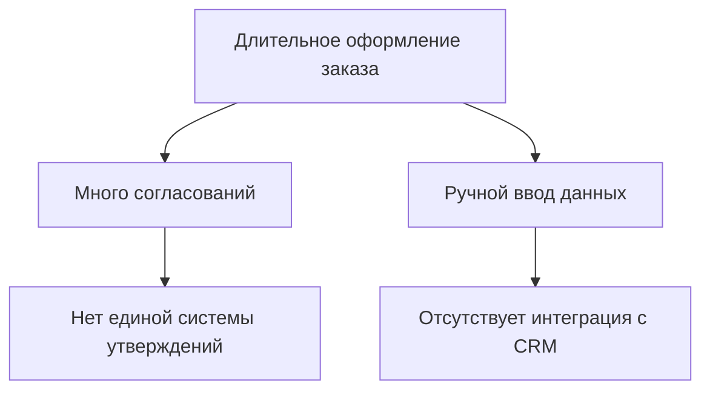
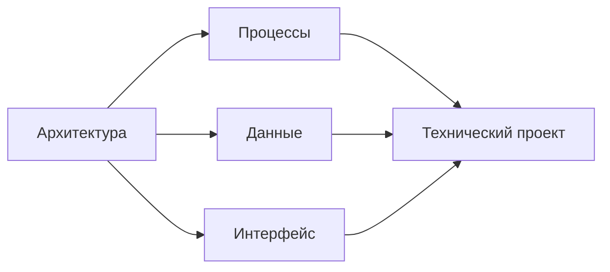

# Анализ требований и проектирвока будущей системы
## 1. Введение
**Разработка информационной системы** (ИС) — сложный, многоэтапный процесс, в котором два ключевых этапа определяют успех всего проекта: анализ требований и проектирование.

> - На этапе анализа мы отвечаем на вопрос: `«Что должна делать система?»`
> - На этапе проектирования — на вопрос: `«Как её создать?»`

Эти этапы тесно связаны: результаты анализа становятся входными данными для проектирования. Только глубокое понимание бизнес-потребностей, ограничений и контекста позволяет спроектировать эффективную, надёжную и масштабируемую систему.

## 2. Этап анализа требований

### 2.1 Основные задачи анализа
**Анализ требований** — процесс выявления, формулирования и структурирования потребностей заказчика и пользователей. Он состоит из трёх ключевых этапов:

- **Построение модели «как есть»** — описание текущего состояния бизнес-процессов и ИТ-инфраструктуры.
- **Определение узких мест и реинжинирин**г — выявление неэффективных операций и возможностей улучшения.
- **Построение модели «как будет»** — проектирование целевой функциональности ИС.


### 2.2 Виды требований
| Вид требований             | Примеры                                                                 |
|----------------------------|-------------------------------------------------------------------------|
| **Бизнес-требования**      | «Увеличить долю рынка», «Снизить издержки»                             |
| **Требования пользователя**| «Просматривать расписание клиентов»                                    |
| **Функциональные требования**| «Ввод заявок через сайт», «Назначение исполнителей»                   |
| **Нефункциональные требования**| «Время отклика ≤ 3 с», «Поддержка 1000 одновременных пользователей» |
| **Системные требования**   | «Работа на Windows Server 2022, СУБД PostgreSQL 15»                    |

### 2.3 Методы обследования предметной области


| Метод | Краткое описание |
|-------|------------------|
| **Интервью** | Прямое общение с пользователями (открытие/закрытие/уточнение вопросов) |
| **JAD (совместная разработка)** | Семинары с модератором, ИТ-специалистами и пользователями |
| **Анкетирование** | Массовый сбор мнений (многоальтернативные, рейтинговые, ранжирующие вопросы) |
| **Анализ документов** | Изучение инструкций, регламентов, существующих систем |
| **Наблюдение** | Пассивное или активное наблюдение за работой сотрудников |

### 2.4.Методы выявления узких мест
После построения модели «как есть» проводится анализ на предмет улучшений:

>- Анализ проблем — выявление текущих трудностей.
>- Анализ основных причин («5 Почему») — поиск корневых причин, а не симптомов.
>- Анализ времени выполнения БП — выявление простоев между этапами.
>- Калькуляция на основе действий — оценка стоимости операций.
>- Бенчмаркинг — сравнение с лидерами отрасли.
>- Анализ результатов — фокус на ценности для клиента.
>- Анализ технологий — применение новых ИТ-решений для трансформации процессов.

>"Выбор метода зависит от контекста: для повышения эффективности — анализ причин; для инноваций — бенчмаркинг и анализ технологий." 

### 2.5 Формирование вариантов использования (Use Case)
**Варианты использования**  — описание последовательности взаимодействия пользователя и системы.

**Принцип:**
>Каждое элементарное бизнес-событие → один вариант использования.

Этапы разработки:

- Определение бизнес-событий;
- Сопоставление с прецедентами;
- Выделение шагов, триггеров, входов/выходов;
- Валидация полноты.

## 3. Этап проектирования инофрмационной системы
### 3.1 Цели и стратегии получения ИС
***На этапе проектирования определяется как реализовать систему:***
|Стратегия|Описание|
|---------|--------|
| **Разработка с нуля**| Полная кастомизация под бизнес|
|**Покупка и адаптация**|Использование ERP/CRM с настройкой|
|**Гибридный подход**|Готовое ядро + кастомные модули|

### 3.2 Преобразование нефункциональных требований
**Нефункциональные требования** (НФТ) преобразуются в системные требования, определяющие архитектуру:

- **Ограничения** (платформы, стандарты)
- **Внешние интерфейсы** (API, интеграции)
- **Производительность**
- **Надёжность**
- **Безопасность**

Эти требования ложатся в основу `технической спецификации` оборудования и ПО.

### 3.3 Основные компоненты проектирования
Этап включает четыре направления:

1. **Архитектура системы**
2. **Модель системных процессов** (физическая реализация)
3. **Модель данных**(логическая → физическая БД)
4. **Пользовательский интерфейс**



### 3.4 Дизайн архитектуры ИС
Любая ИС состоит из четырёх компонентов:

- ***Хранение данных***
- ***Логика доступа к данным***
- ***Бизнес-логика***
- ***Логика представления***

Основные архитектурные стили:

|Архитектура|Особенности|
|-----------|-----------|
|**Клиент-сервер** (2-уровневая)|Толстый/тонкий клиент; данные на сервере|
|**Трёхуровневая**|UI → Сервер приложений → БД; лёгкое сопровождение|
|**Веб-приложение**|Клиент — браузер; обмен через HTTP; сессии|
|**SOA** (сервис-ориентированная)|Независимые сервисы с API; высокая интегрируемость|


>"Выбор архитектуры зависит от инфраструктуры, опыта команды и требований к масштабируемости."

### 3.5 Эксплуатационные требования
Определяют среду функционирования ИС:

- **Техническая среда**: ОС, СУБД, ПО
- **Интеграция**: взаимодействие с другими системами
- **Переносимость**: поддержка новых устройств (мобильные, планшеты)
- **Эксплуатация**: режим работы (24/7?), персонал, регламенты
>  Для систем с высокой переносимостью предпочтительна тонкоклиентная веб-архитектура. 
### 3.6 Требования к производительности
***Должны быть измеримыми и тестируемыми:***
|Параметр|Корректная формулировка|
|--------|-----------------------|
|Время отклика|≤ 4 секунд|
|Макс. пользователей|5000 одновременно|
|Объём данных|до 2 ТБ|
|Восстановление|≤ 15 минут после сбоя|

Эти требования определяют выбор оборудования, СУБД, кэширования, балансировщиков нагрузки.

### 3.7 Требования к безопасности
**Безопасность** — защита от умышленных и случайных угроз.
Подход к оценке:

```
Бюджет на безопасность ≈ Вероятность угрозы × Ожидаемый ущерб
```
Ключевые элементы:
- Контроль доступа (RBAC)
- Шифрование (TLS, AES)
- Аутентификация (2FA, SSO)
- Аудит и ЭЦП
> Безопасность закладывается на этапе проектирования, а не добавляется позже. 

### 3.8 Культурные и политические требования
Актуальны при международном использовании ИС:

- **Многоязычность**: перевод интерфейса, адаптация под длину строк
- **Локализация**: формат даты, валюта, единицы измерения
- **Индивидуальные настройки**: гибкость под пользователя
- **Правовые нормы**: GDPR, ФЗ-152, HIPAA и др.

## 4. Заключение
Этапы анализа требований и проектирования образуют фундамент успешного проекта по созданию информационной системы.

- Анализ обеспечивает глубокое понимание бизнес-контекста, пользовательских потребностей и ограничений.
- Проектирование трансформирует эти знания в технически реализуемую архитектуру, модели данных и интерфейсов.

Только при тесной связи этих этапов, систематическом подходе к сбору требований и взвешенном выборе архитектурных решений возможно создание ИС, которая:

- соответствует бизнес-целям,
- удобна для пользователей,
- масштабируема и надёжна,

- соответствует нормативным и культурным требованиям.
