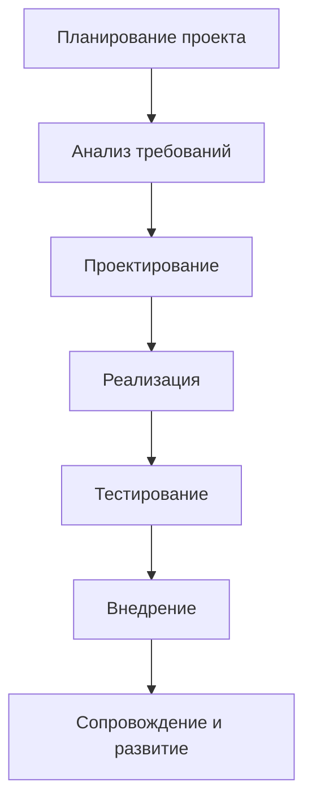
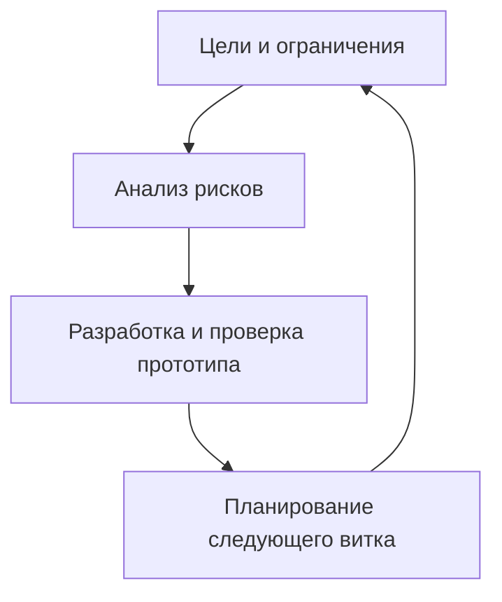

#Этапы разработки и внедрения информационной системы

Информационная система (ИС) — это совокупность программных, аппаратных, организационных и человеческих ресурсов, предназначенных для сбора, хранения, обработки и выдачи информации в интересах достижения поставленных целей. Процесс её создания и внедрения требует системного подхода и чёткого соблюдения этапов жизненного цикла.

---

## 1. Общая схема жизненного цикла ИС

Этот цикл может быть линейным (каскадным), итеративным или гибким — в зависимости от выбранной модели управления проектом.

---

## 2. Описание этапов

### **1. Планирование проекта**

**Цель:** Обосновать необходимость создания ИС и определить рамки проекта.

**Ключевые действия:**
- Формулировка стратегических и тактических целей
- Анализ бизнес-процессов, подлежащих автоматизации
- Определение ограничений (бюджет, сроки, персонал)
- Оценка рисков и разработка стратегии их минимизации
- Подготовка технико-экономического обоснования (ТЭО) и бизнес-кейса

**Результат:**  
Утверждённый проектный устав, план управления проектом, список заинтересованных сторон .

---

### **2. Анализ требований**

**Цель:** Получить полное и точное представление о том, что система должна делать.

**Методы сбора требований:**
- Интервью и анкетирование
- Наблюдение за текущими процессами
- Анализ документации и регламентов
- Создание пользовательских сценариев (user stories)

**Типы требований:**
- **Функциональные**: что система должна делать (например, «система должна позволять авторизоваться»)
- **Нефункциональные**: как она это должна делать (производительность, безопасность, масштабируемость и т.п.)

**Результат:**  
Документ «Спецификация требований к программному обеспечению» (Software Requirements Specification, SRS).

---

### **3. Проектирование**

**Цель:** Создать техническую модель системы на основе требований.

**Подэтапы:**
- **Архитектурное проектирование**: выбор архитектурного стиля (клиент-сервер, микросервисы и др.)
- **Проектирование базы данных**: ER-диаграммы, нормализация, выбор СУБД
- **Проектирование интерфейсов**: макеты (wireframes), UX/UI-дизайн
- **Проектирование интеграций**: API, форматы обмена данными

**Результат:**  
Техническое задание (ТЗ), диаграммы архитектуры, модели данных, прототипы интерфейсов.

---

### **4. Реализация (разработка)**

**Цель:** Создать рабочую версию системы.

**Основные работы:**
- Написание программного кода по модулям
- Настройка серверов, баз данных, сетевой инфраструктуры
- Интеграция с внешними системами (CRM, ERP, платежные шлюзы и др.)
- Ведение документации (комментарии в коде, руководства разработчика)

**Практики:**
- Версионный контроль (Git)
- Непрерывная интеграция (CI)
- Code review

**Результат:**  
Рабочая сборка системы, готовая к тестированию.

---

### **5. Тестирование**

**Цель:** Убедиться, что система соответствует требованиям и работает корректно.

**Виды тестирования:**
| Вид | Описание |
|-----|--------|
| Модульное (unit) | Проверка отдельных компонентов |
| Интеграционное | Проверка взаимодействия модулей |
| Системное | Проверка всей системы как единого целого |
| Приёмочное (UAT) | Тестирование конечными пользователями |

**Методы:**
- Ручное и автоматизированное тестирование
- Нагрузочное и стресс-тестирование
- Тестирование безопасности

**Результат:**  
Отчёт о тестировании, исправленные дефекты, система, готовая к запуску.

---

### **6. Внедрение**

**Цель:** Перевод системы из тестовой среды в рабочую эксплуатацию.

**Этапы внедрения:**
- Подготовка инфраструктуры (серверы, сети, резервное копирование)
- Миграция данных из старых систем
- Обучение пользователей (тренинги, инструкции, демо-режим)
- Пилотный запуск (на одном подразделении) или «большой старт»
- Поддержка в первые дни эксплуатации 

**Стратегии внедрения:**
- **Параллельная**: старая и новая системы работают одновременно
- **Постепенная**: поэтапный переход (по отделам/функциям)
- **Мгновенная (big bang)**: полный переход за один день

**Результат:**  
Система функционирует в реальных условиях, пользователи работают с ней.

---

### **7. Сопровождение и развитие**

**Цель:** Обеспечить стабильную работу ИС и её адаптацию к меняющимся условиям.

**Виды сопровождения:**
- **Корректирующее**: устранение ошибок
- **Адаптивное**: модификация под новые требования
- **Совершенствующее**: улучшение функциональности и производительности

**Деятельность:**
- Мониторинг и логирование
- Обновление ПО и безопасности
- Обратная связь от пользователей
- Планирование новых версий

**Результат:**  
Долгосрочно эксплуатируемая, надёжная и развивающаяся ИС.

---

## 3. Модели жизненного цикла ИС

### **Каскадная модель (Waterfall)**

- **Плюсы**: Простота, чёткая документация, легко управлять сроками.
- **Минусы**: Негибкость, трудно вносить изменения после завершения этапа.

> Подходит для проектов с фиксированными требованиями (например, госзаказы).

---

### **Спиральная модель (Spiral)**

- Каждый виток спирали — это цикл: планирование → оценка рисков → разработка → оценка.
- Позволяет управлять рисками и постепенно уточнять требования.

> Используется в крупных, сложных, инновационных проектах.

---

### **Гибкие методологии (Agile, Scrum, Kanban)**

**Особенности:**
- Работа короткими итерациями (спринтами по 1–4 недели)
- Регулярные демонстрации результатов 
- Приоритет — рабочее ПО, а не документация
- Гибкость к изменениям даже на поздних этапах

**Роли в Scrum:**
- Product Owner — определяет приоритеты
- Scrum Master — обеспечивает процесс
- Команда разработчиков — реализует задачи

> Идеально подходит для стартапов и проектов с нестабильными требованиями.

---

## 4. Ключевые факторы успеха

| Фактор | Почему важен |
|--------|--------------|
| **Чёткие цели и требования** | Снижает риск переделок и срывов сроков |
| **Участие пользователей** | Обеспечивает соответствие системы реальным нуждам |
| **Поддержка руководства** | Гарантирует выделение ресурсов и приоритетность проекта |
| **Квалифицированная команда** | Качество зависит от экспертизы разработчиков и аналитиков |
| **Управление изменениями** | Помогает адаптировать организацию к новой системе |
| **Обучение пользователей** | Повышает принятие системы и снижает сопротивление |

---

## 5. Заключение

Разработка и внедрение информационной системы — это не просто техническая задача, а **организационный процесс**, затрагивающий людей, процессы и технологии. Успех зависит не только от качества кода, но и от:
- Глубины понимания бизнес-задач
- Способности управлять изменениями
- Правильного выбора методологии
- Грамотного взаимодействия между всеми участниками проекта

> Современные проекты всё чаще используют **гибридные подходы**, сочетающие структурированность каскадной модели с гибкостью Agile, чтобы сбалансировать контроль и адаптивность.

