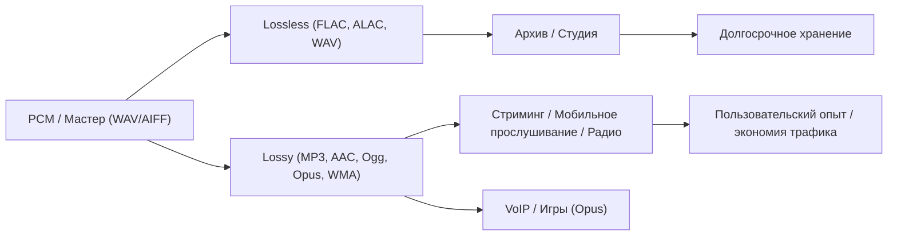

# Основные форматы звуковых файлов и области их применения

## Введение
Кратко: аудиоформаты отличаются тем, как они хранят звук (без потерь или с потерями), какие метаданные поддерживают и как компромисс между качеством и объёмом влияет на практические сценарии (стриминг, студийная работа, архивирование). Ниже — подробный разбор по пунктам.

---

## 1. Сжатие и качество

### Психоакустическое маскирование — что это и зачем нужно

- Психоакустическое маскирование — это свойство человеческого слуха: громкий звук на определённой частоте делает практически неразличимыми более тихие звуки в соседних частотах или в тот же момент времени. Кодеки типа MP3 и AAC используют это свойство, чтобы убрать звуковые компоненты, которые, по оценке алгоритма, будут незаметны человеку.
- Почему это не просто «уменьшение разрешения»:
  - Уменьшение разрешения (например, понижение частоты дискретизации или обрезка частот) — грубая, частотно-независимая операция. Психоакустическое сжатие — адаптивное: оно решает, какие части звука удалить, исходя из контекста (сильных/слабых тонов, временной маски и т.д.).
  - Поэтому при одинаковом объёме данных lossy-кодек сохраняет важное для восприятия, удаляя «лишние» компоненты, а не просто урезает полосу частот.

Пример:
- В оркестровой партитуре сильный удар большого барабана может «закрыть» слабые высокие нотки в тот же момент — кодек может удалить эти слабые компоненты без заметной потери качества.

### Роль битрейта (kbps) в MP3 и AAC

- Битрейт — это скорость передачи данных (килобит в секунду). Чем выше битрейт — тем больше информации кодек может сохранить → потенциально выше качество.
- Практические ориентиры (примерно, зависят от источника, реализации кодека и материала):
  - MP3: 128 kbps — заметно компромиссный; 192 kbps — хорош для большинства слушателей; 256–320 kbps — высокий уровень, уже трудно отличить от оригинала на бытовом оборудовании.
  - AAC: при тех же битрейтах обычно даёт лучшее качество, чем MP3 (т.е. AAC @128 kbps ≈ MP3 @160–192 kbps по восприятию).
- Порог для «неподготовленного» слушателя:
  - Большинство людей начнут замечать ухудшение при MP3 <128 kbps. Для AAC комфортный порог может быть ниже (≈96–128 kbps), но это зависит от музыки (сложные миксы и высокая динамика страдают больше).
- Что ещё влияет на восприятие:
  - Качество исходника (оригинальная запись).
  - Уровень громкости, используемое устройство (наушники vs колонки), акустика и слух слушателя.
  - Кодировщик (встроенный MP3 кодек vs LAME с разными настройками).

---

## 2. Lossless vs. Lossy: теория и практика

### В чём принципиальная разница между lossless-форматами (FLAC, ALAC) и ZIP

- Lossless (без потерь) — алгоритм сжимает аудиоданные таким образом, что при распаковке получаем точно байт-в-байт исходный PCM-поток. FLAC/ALAC оптимизированы конкретно под аудиоданные: они используют предикторы, модели корреляции между сэмплами, специальные блоки и метаданные, что делает сжатие эффективным и потоковым.
- ZIP — общий алгоритм, не специализированный для аудио. ZIP использует LZ77/DEFLATE, который хорошо работает для текстов и повторяющихся шаблонов, но не учитывает временную и спектральную структуру аудио, поэтому обычно уступает FLAC по компрессии и удобству (нет встроенной поддержки потоковой передачи блоков аудио).
- Почему FLAC часто уменьшает размер примерно вдвое:
  - Аудио PCM содержит высокую корреляцию между соседними сэмплами; FLAC использует прогнозирование и кодирование остатка, а затем эффективно кодирует остатки энтропийными методами — всё это обеспечивает значительную экономию без потерь.
  - Фактический коэффициент зависит от материала (синтетический сигнал vs живая запись), частоты дискретизации и разрядности.

### Можно ли преобразовать lossy обратно в lossless?

- Нет — это необратимый процесс. При кодировании в lossy формат (MP3, AAC) часть информации отброшена намеренно, поэтому из MP3 уже нельзя восстановить оригинальные потерянные детали.
- Что возможно:
  - Можно перекодировать MP3 в FLAC, но это просто сохранение уже декодированных (потерянных) данных в контейнере без потерь — не восстановит утраченное качество.
  - Существуют алгоритмы на основе машинного обучения, создающие «апскейл» или реконструкцию деталей, но это догадки/восстановление, а не восстановление исходного битового потока.

---

## 3. Структура и метаданные

### Роль метаданных (ID3, Vorbis comments, FLAC tags)

- Метаданные — это информация о файле: название, артист, альбом, год, обложка, текст и т. п. Они не влияют на аудиосодержимое, но важны для организации и удобства пользователя.
- Форматы:
  - MP3: ID3 (v1/v2) — гибкая система тегов с поддержкой обложек и текстов.
  - FLAC: Vorbis comments + собственные блоки для картинок и служебной информации.
  - AAC (в контейнере MP4/M4A): метаданные в виде MP4 atoms.
- Почему некоторые устройства не показывают метаданные:
  - Неполная или устаревшая поддержка формата тегов в прошивке.
  - Использование старого формата тега (ID3v1) вместо ID3v2 или нестандартное кодирование полей.
  - Ограничения интерфейса устройства (показывает только несколько полей).

### Как плеер определяет поддержку формата

- Плеер читает заголовочный «магический» блок файла (напр., RIFF для WAV, fLaC для FLAC, ID3/MP3 frame для MP3, ftyp для MP4/AAC) и решает, есть ли встроенный декодер для него.
- Причины несовместимости:
  - Аппаратный декодер может быть реализован только для популярных форматов (MP3), а менее распространённые — в ПО.
  - Лицензирование кодеков (в прошлом) заставляло производителей экономить на поддержке определённых форматов.

---

## 4. Применение в разных сценариях

### Почему стриминговые сервисы чаще используют lossy

- Экономия пропускной способности и стоимости хранения: lossy уменьшает поток в несколько раз по сравнению с lossless, что важно при миллионах слушателей.
- Компромисс: при разумном битрейте пользователь получает «достаточно хорошее» качество, а платформа — меньше затрат на трафик и быстрее старт потоков.
- Дополнительные причины:
  - Мобильный трафик ограничен.
  - Плавность смены качества при адаптивном стриминге (ABR).

### Форматы для музыкального производства

- На этапе записи/микширования/мастеринга используют несжатый PCM (WAV, AIFF) или lossless (FLAC, ALAC) с высокой разрядностью (24-bit или 32-bit float) и высокой частотой дискретизации (44.1–192 kHz, иногда выше).
- Причины: сохраняется вся информация, даются возможности для обработки с «запасом» по динамике и частоте.
- Для распространения: финальный мастер часто кодируют в lossy (MP3/AAC) для потребления, но оригиналы и мастер-версии хранятся в lossless.

### Требования для радио, видео и стриминга

- Радио: традиционно используют стандарты вещания и компромиссы по битрейту; важна устойчивость канала и совместимость.
- Постпродакшн видео: обычно используют WAV/BWF (Broadcast WAV) с тайм-кодами и метаданными, дорожки в 48 kHz.
- Стриминг: выбор кодека зависит от устройства и сценария (Opus — для голоса/веб-RTC, AAC/MP3 — для музыки и compatibility).

---

## 5. Кодеки и алгоритмы

### Основные алгоритмы в современных кодеках

- Преобразования в частотную область: MDCT (Modified Discrete Cosine Transform) и другие фильтрбанки переводят сигнал в спектр.
- Психоакустическая модель: оценивает, какие спектральные компоненты можно убрать без заметной потери качества.
- Квантование и энтропийное кодирование: квантование уменьшает точность коэффициентов, затем применяют кодирование Хаффмана или арифметическое кодирование для компактного представления.

### Чем AAC лучше MP3 (вкратце)

- Более гибкие оконные функции и длины блоков, улучшенная психоакустическая модель, более эффективное квантование и улучшенное энтропийное кодирование — в результате AAC даёт лучшее качество при тех же битрейтах.

### Почему некоторые форматы не массовы

- Внедрение зависит не только от качества: лицензирование, маркетинг, аппаратная поддержка и сетевые эффекты играют решающую роль (MP3 получил первые массовые преимущества).

---

## 6. Кроссплатформенность и совместимость

### Универсальный формат — существует ли он?

- Практически наиболее универсальными являются WAV (PCM) и MP3: WAV — почти везде читается, MP3 — широкая совместимость и компактность. Но ни один формат не идеален везде.

### Историческая эволюция

- WAV/AIFF как исходники на ПК и Mac → MP3 массово в 1990-х/2000-х → AAC/FLAC/Opus/OGG возникли позже для специальных задач (lossless, улучшенная эффективность, интерактивность).

---

## 7. Архивирование и консервация

### Что выбирать для долгосрочного хранения

- Рекомендация: хранить мастер в lossless (WAV/BWF или FLAC/ALAC) с контролем целостности и резервированием.
- Практика: правило 3-2-1 (3 копии, 2 носителя, 1 вне сайта), хранение контрольных сумм (SHA-256), регулярная проверка и миграция на новые носители.
- Не храните только lossy-версии как единственный артефакт — это потеря информации навсегда.

---

## Сравнительная таблица форматов

| Формат | Тип | Типичный профиль / битрейт / разрядность | Основные области применения | Преимущества | Ограничения |
|---|---:|---|---|---|---|
| MP3 | Lossy | 96–320 kbps (обычно 128–320) | Прослушивание, портативные плееры, совместимость | Широкая поддержка, небольшие файлы | Потери качества при низких битрейтах |
| AAC (MP4/M4A) | Lossy | 96–320 kbps (эффективнее MP3) | Потоковые сервисы, мобильные устройства | Лучше MP3 при тех же kbps, поддержка контейнера MP4 | Лицензирование в прошлом, не везде аппаратно |
| Ogg Vorbis | Lossy | VBR обычно 96–256 kbps | Игровые движки, архивные проекты, стриминг (исторически) | Открытый формат, хорошее качество при низких битрейтах | Менее распространён в потребительской электронике |
| Opus | Lossy (реально оптимизирован для голоса и музыки) | 6–510 kbps; очень эффективен на низких битрейтах | VoIP, веб-аудио, стриминг с низкой задержкой | Отлично для речи и интерактивных задач, низкая задержка | Старое оборудование может не поддерживать |
| FLAC | Lossless | Сжатие ~30–60% от WAV; 16/24-bit, 44.1–192 kHz | Архивирование, аудиофильские релизы, стриминг lossless | Полная сохранность исходника, метаданные | Больший размер по сравнению с lossy |
| ALAC | Lossless | Аналогично FLAC; нативен в экосистеме Apple | Архивирование внутри Apple-экосистемы, iTunes | Поддержка Apple, lossless | Меньше распространён вне Apple |
| WAV / AIFF | Lossless (несжатый PCM) | 16/24/32-bit, 44.1–384 kHz | Студия, редактирование, обмен мастерами | Простота, универсальная поддержка | Очень большие файлы, мало метаданных (WAV требует BWF для доп.данных) |
| WMA | Lossy / Lossless | Различные профили | Windows-окружение, историческое кодирование | Интеграция с Windows | Лицензирование, ограниченная кроссплатформенность |

## Схема — простая диаграмма (Mermaid)

