# Технологии дополненной и виртуальной реальности: принципы работы и историческое развитие

Технологии дополненной (AR) и виртуальной (VR) реальности кажутся чем-то непонятным и сложным, но на самом деле их основные принципы работы можно понять без специальных технических знаний. Обе технологии направлены на изменение того, как мы воспринимаем и взаимодействуем с цифровым миром, но делают это разными способами.

## 1. Основные принципы технологий

### Как выбрать между VR и AR?

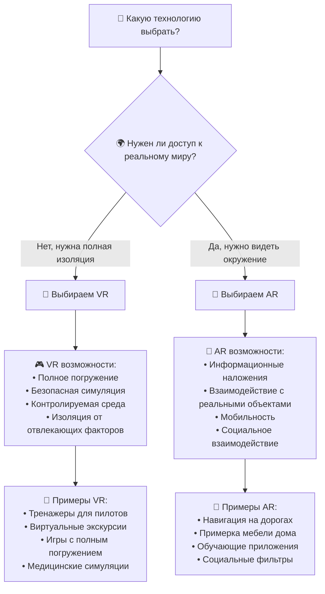

VR создает полностью искусственное окружение, которое заменяет собой реальный мир. Надевая VR-шлем, вы больше не видите комнату вокруг себя — вместо этого вы попадаете в компьютерную симуляцию. Это может быть игровой мир, образовательная среда или виртуальное рабочее пространство. Ключевой принцип здесь — полное погружение, и все что вы видите, слышите и чувствуете создано компьютером.

**Пример VR:** Представьте, что вы хирург и отрабатываете сложную операцию на сердце. В VR вы можете полностью "погрузиться" в операционную, где каждая деталь — от инструментов до анатомии пациента — создана компьютером, но выглядит абсолютно реалистично.

AR работает по другому принципу — она не заменяет реальность, а обогащает ее цифровыми элементами. С помощью AR-очков или камеры телефона вы видите реальный мир с наложенной компьютерной графикой: тексты, 3D-объекты, анимации. Это похоже на интерфейсы из фантастических фильмов, где персонажи видят дополнительную информацию о людях и объектах вокруг себя.

**Пример AR:** Направив камеру телефона на пустую комнату, вы можете "поставить" туда виртуальный диван и посмотреть, как он будет выглядеть в интерьере, прежде чем покупать настоящий.

### Сравнительная таблица VR и AR технологий

| Аспект | Виртуальная реальность (VR) | Дополненная реальность (AR) |
|--------|-----------------------------|-----------------------------|
| **Основной принцип** | Полное замещение реальности | Обогащение реальности цифровыми элементами |
| **Обработка окружения** | Не анализирует реальный мир | Постоянно анализирует реальное окружение |
| **Ключевые технологии** | Гироскопы, акселерометры, внешние камеры | Компьютерное зрение, распознавание образов, датчики |
| **Основная задача** | Отслеживание движений в виртуальном пространстве | Понимание структуры реального мира |
| **Типичные устройства** | VR-шлемы (Oculus Rift, HTC Vive) | Смартфоны, планшеты, AR-очки (HoloLens) |

## 2. Техническая архитектура систем

Основное техническое различие между этими технологиями заключается в том, как они обрабатывают окружающее пространство. VR-системы не нуждаются в анализе реального мира — они создают свою собственную среду с нуля. AR-системы наоборот должны постоянно анализировать реальное окружение через камеры и датчики, чтобы правильно размещать виртуальные объекты.

### Архитектура VR системы

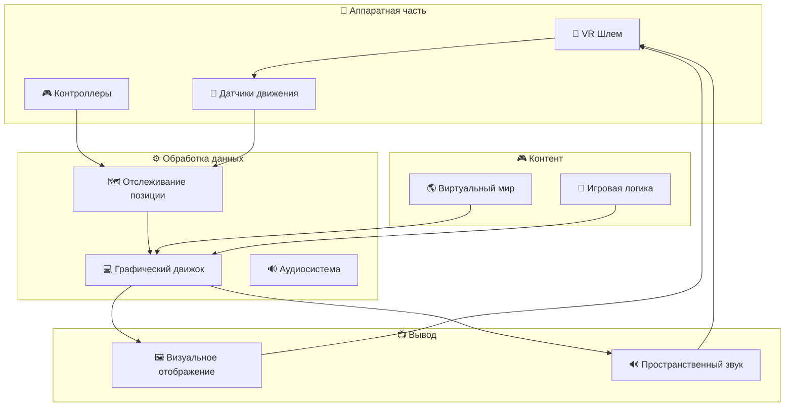

В VR главная задача — отслеживать движения пользователя внутри виртуального пространства. Для этого используются различные датчики — гироскопы, которые определяют повороты головы, акселерометры, фиксирующие ускорение, и внешние камеры или лазерные системы, которые точно определяют положение пользователя в комнате. Все эти данные используются чтобы изображение в шлеме менялось соответственно вашим движениям — если вы поворачиваете голову направо, то и виртуальный мир поворачивается вместе с вами.

### Принцип работы датчиков VR

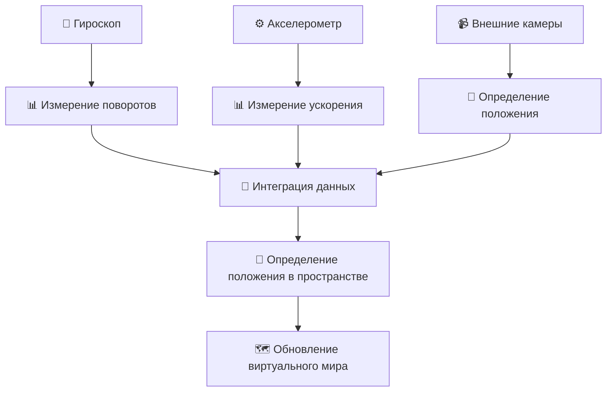

**Подробное объяснение датчиков:**

- **Гироскоп** — измеряет угловую скорость по осям X, Y, Z для определения поворотов головы
- **Акселерометр** — определяет линейное ускорение и ориентацию устройства
- **Внешние камеры** — отслеживают маркеры на шлеме для точного определения положения в комнате

### Процесс работы AR системы

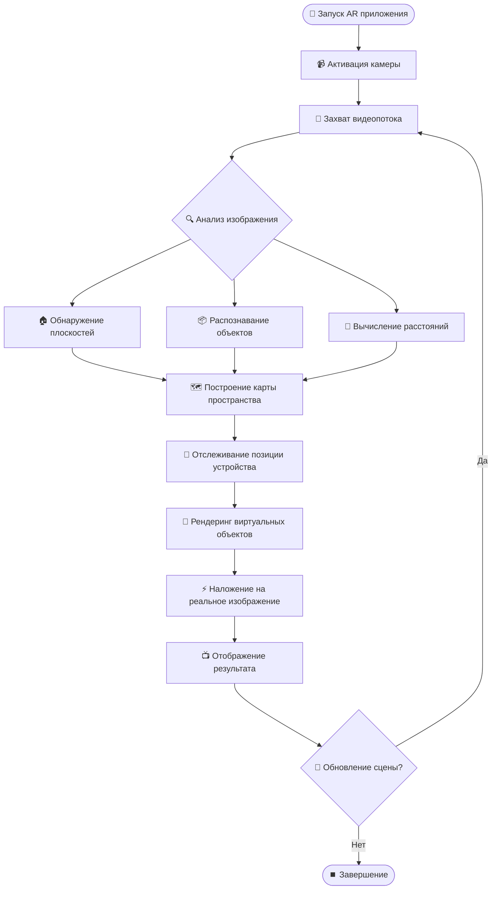

В AR технологии сложнее — здесь система должна не только отслеживать движения устройства, но и понимать структуру реального мира. Камера постоянно снимает окружающее пространство, а специальные алгоритмы анализируют это изображение: находят плоские поверхности, распознают объекты, определяют расстояния. Только после этого система может разместить виртуальный объект так, чтобы он выглядел естественно в реальной среде — например, поставить виртуальный стул на реальный пол так, чтобы он отбрасывал тень и не проваливался сквозь поверхность.

## 3. Историческое развитие AR и VR технологий

### Хронология развития AR/VR технологий

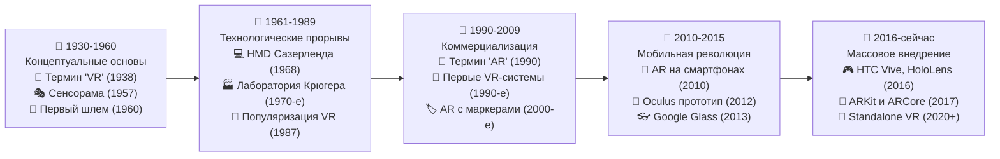

### Хронологическая таблица ключевых событий

| Год | Событие в VR | Событие в AR |
|-----|--------------|--------------|
| 1938 | Антонен Арто вводит термин "виртуальная реальность" | |
| 1957 | Мортон Хейлиг разрабатывает "Сенсораму" | |
| 1960 | Создана "Маска телесферы" - первый прототип VR-шлема | |
| 1968 | Айвен Сазерленд создает первый шлем с дисплеем | |
| 1970-е | Майрон Крюгер создает лабораторию искусственной реальности | |
| 1987 | Термин "VR" популяризирован Джароном Ланье | |
| 1990 | | Термин "дополненная реальность" введен официально |
| 1990-е | Появление коммерческих VR-систем VPL Research | Первые AR-системы с маркерами |
| 2010 | | Развитие AR на мобильных устройствах |
| 2012 | Oculus Rift представляет прототип VR-шлема | |
| 2013 | | Google представляет Google Glass |
| 2016 | Запуск HTC Vive и PlayStation VR | Microsoft представляет HoloLens |
| 2017-2020 | Развитие standalone VR-устройств (Oculus Quest) | Развитие ARKit и ARCore для смартфонов |

## 4. Технические требования и особенности

### Графические и звуковые требования

Обе технологии сильно зависят от возможностей графических процессоров. В VR нужно рендерить два отдельных изображения для левого и правого глаза с очень высокой частотой — обычно 90 раз в секунду или больше. Если частота будет низкой, это может вызвать головокружение и тошноту. В AR задача еще сложнее — нужно в реальном времени накладывать компьютерную графику на видео с камеры, при этом учитывая освещение, тени и перспективу реального мира.

Звук тоже играет важную роль в создании эффекта погружения. В современных системах используется пространственный звук, который создает эффект присутствия. Если в виртуальном мире сзади вас что-то происходит, вы услышите этот звук именно сзади, даже если повернете голову, звук останется на своем месте в виртуальном пространстве.

### Устройства ввода и взаимодействие

Устройства ввода — контроллеры, перчатки, трекеры — позволяют взаимодействовать с виртуальными мирами. Самые продвинутые системы могут отслеживать движения пальцев, что делает взаимодействие более естественным. В AR взаимодействие часто происходит через сенсорный экран или голосовые команды, но появляются и более сложные системы, которые понимают жесты рук в воздухе.

### Таблица принципов функционирования VR и AR технологий

| Принцип функционирования | Виртуальная реальность (VR) | Дополненная реальность (AR) |
|-------------------------|-----------------------------|-----------------------------|
| **Обработка окружающего пространства** | Полное игнорирование реального мира, создание среды с нуля | Постоянный анализ реального окружения через камеры и датчики |
| **Отслеживание движений** | Отслеживание движений пользователя внутри виртуального пространства с помощью гироскопов, акселерометров и внешних камер | Отслеживание движений устройства + анализ структуры реального мира |
| **Графическая обработка** | Рендеринг двух отдельных изображений для левого и правого глаза с частотой 90 Гц и выше | Наложение компьютерной графики на видео с камеры в реальном времени |
| **Взаимодействие с окружением** | Полное замещение реальных объектов виртуальными | Интеграция виртуальных объектов в реальную среду с учетом освещения, теней и перспективы |
| **Анализ пространства** | Не требуется анализ реального пространства | Распознавание плоских поверхностей, объектов, определение расстояний |
| **Позиционирование объектов** | Объекты размещаются в заранее определенных координатах виртуального мира | Объекты привязываются к реальным точкам пространства после анализа окружения |
| **Технические требования** | Высокая частота обновления, минимальная задержка для предотвращения киберболезни | Сложные алгоритмы компьютерного зрения, машинное обучение для точного позиционирования |
| **Взаимодействие с пользователем** | Специализированные контроллеры, перчатки, трекеры движений | Сенсорные экраны, голосовые команды, распознавание жестов |

## 5. Проблемы и решения

#### ВНИМАНИЕ: Немного интерактива! Выделите внизу схему, удерживая левой кнопкой мыши, чтобы можно было увидеть текст в черной заливке!
### Основные проблемы VR и AR технологий

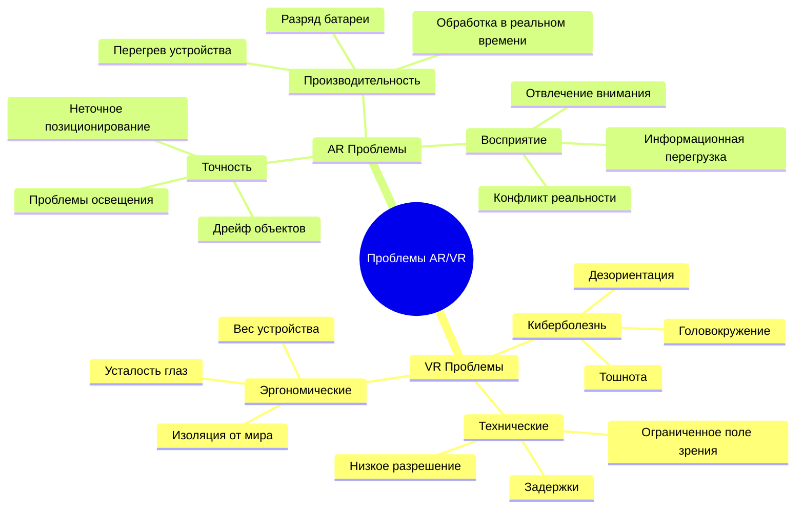

### Методы решения проблем

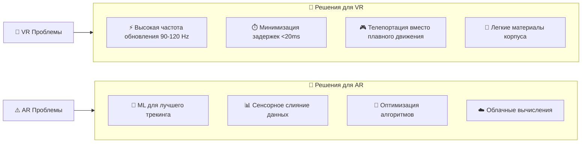

Одной из главных проблем VR до сих пор остается "киберболезнь" — чувство тошноты и дискомфорта, которое возникает когда то, что вы видите, не совпадает с тем, что чувствует ваш вестибулярный аппарат. Разработчики борются с этим разными способами — увеличивают частоту обновления экранов, уменьшают задержки, используют специальные техники перемещения в виртуальном пространстве.

В AR основные сложности связаны с точностью позиционирования виртуальных объектов. Если объект "плывет" или неправильно взаимодействует с реальными предметами, это сразу разрушает иллюзию. Для решения этой проблемы используются все более сложные алгоритмы компьютерного зрения и машинного обучения.

## 6. Практическое применение

### Детальное сравнение VR и AR

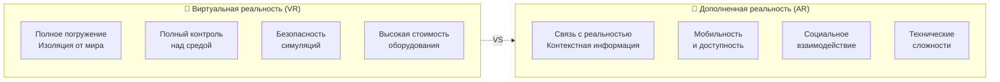

| Критерий | VR | AR |
|----------|----|----|  
| **Уровень погружения** | ⭐⭐⭐⭐⭐ Полное | ⭐⭐⭐ Частичное |
| **Связь с реальностью** | ⭐ Отсутствует | ⭐⭐⭐⭐⭐ Постоянная |
| **Мобильность** | ⭐⭐ Ограниченная | ⭐⭐⭐⭐⭐ Высокая |
| **Стоимость внедрения** | ⭐⭐ Высокая | ⭐⭐⭐⭐ Средняя |
| **Простота использования** | ⭐⭐⭐ Требует обучения | ⭐⭐⭐⭐ Интуитивная |
| **Безопасность обучения** | ⭐⭐⭐⭐⭐ Максимальная | ⭐⭐⭐ Ограниченная |

### Карта применений AR/VR по отраслям

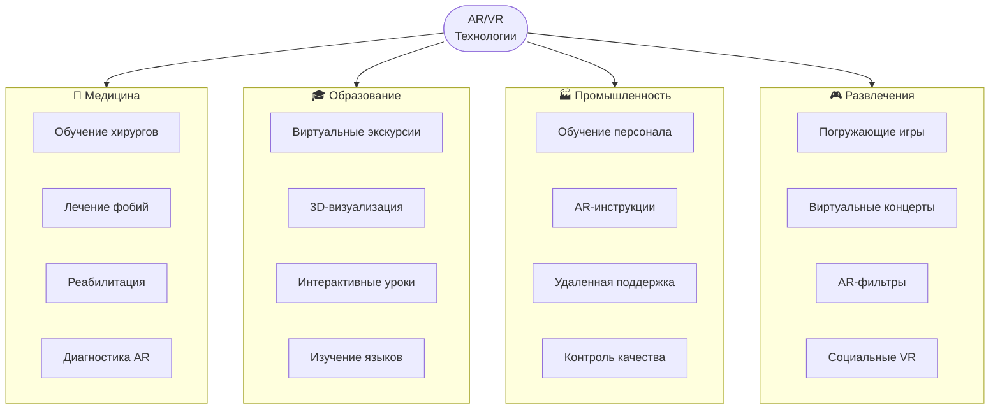

### Процесс внедрения технологий в отрасль

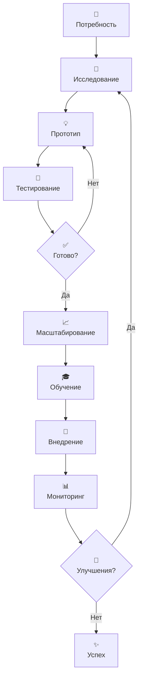

Практическое применение этих технологий уже вышло далеко за рамки игр и развлечений. В медицине VR используется для обучения хирургов — они могут отрабатывать сложные операции на виртуальных пациентах. В промышленности рабочие с помощью AR-очков получают инструкции по сборке сложного оборудования — виртуальные стрелки показывают куда ставить детали, а текстовые подсказки объясняют что делать далее.

В образовании VR позволяет ученикам "посещать" исторические события или научные эксперименты которые невозможно воспроизвести в классе. AR делает учебные материалы интерактивными — можно направить камеру смартфона на изображение молекулы и увидеть ее трехмерную модель которую можно рассмотреть со всех сторон.

В архитектуре и дизайне заказчики могут "пройтись" по еще не построенному дому в VR и внести изменения до начала строительства. С помощью AR можно посмотреть как новая мебель будет выглядеть в вашей квартире — система точно разместит виртуальный диван или стол в реальном пространстве комнаты.

### Таблица технического применения VR и AR в различных сферах общества

| Сфера применения | Применение VR технологий | Применение AR технологий |
|-----------------|-------------------------|-------------------------|
| **Медицина и здравоохранение** | Тренировка хирургов на виртуальных операциях, лечение фобий через экспозиционную терапию, реабилитация пациентов после инсультов | Наложение диагностической информации на тело пациента, помощь в проведении операций с визуализацией внутренних органов, обучение медицинского персонала |
| **Образование** | Виртуальные экскурсии в исторические места, полностью погружающее обучение сложным научным концепциям, симуляции физических и химических экспериментов | Интерактивные учебники с 3D-моделями, визуализация сложных структур (молекулы, органы), обучающие приложения с распознаванием объектов |
| **Промышленность и производство** | Проектирование и тестирование производственных линий, обучение работе с опасным оборудованием, симуляции процессов сборки | Пошаговые инструкции по сборке сложных механизмов, удаленная помощь экспертов через AR-интерфейсы, контроль качества с наложением эталонных изображений |
| **Архитектура и строительство** | Визуализация архитектурных проектов до начала строительства, виртуальные прогулки для заказчиков, тестирование эргономики пространств | Наложение проектной документации на реальную строительную площадку, визуализация скрытых коммуникаций, контроль соответствия проекта реализации |
| **Розничная торговля** | Виртуальные примерочные, полностью погружающие демонстрации товаров, виртуальные выставочные залы | Предпросмотр мебели в интерьере квартиры, интерактивные каталоги товаров, навигация в крупных торговых центрах |
| **Развлечения и игры** | Полностью погружающие игровые миры, виртуальные кинотеатры, интерактивные развлекательные проекты | Мобильные игры с интеграцией в реальное окружение, интерактивные музеи и выставки, расширенный просмотр спортивных событий |
| **Транспорт и логистика** | Тренажеры для пилотов и водителей, симуляции сложных дорожных ситуаций, планирование логистических маршрутов | AR-навигация для водителей, оптимизация процессов погрузки-разгрузки, визуализация маршрутов доставки |
| **Военная сфера** | Тренировка солдат в реалистичных боевых сценариях, симуляции работы со сложным военным оборудованием | Тактические дисплеи с наложенной информацией о местности, системы целеуказания, распознавание объектов на поле боя |
| **Спорт и фитнес** | Визуализация техники выполнения упражнений, симуляции спортивных соревнований, анализ движений спортсменов | Наложение статистики в реальном времени во время тренировок, AR-тренеры, анализ техники выполнения упражнений |
| **Искусство и дизайн** | Создание погружающих инсталляций, виртуальные галереи и выставки, 3D моделирование в виртуальном пространстве | Интерактивные арт-объекты, визуализация дизайнерских проектов в реальной среде, дополненные выставки |

## 7. Будущее технологий

### Прогноз развития AR/VR на ближайшие 10 лет

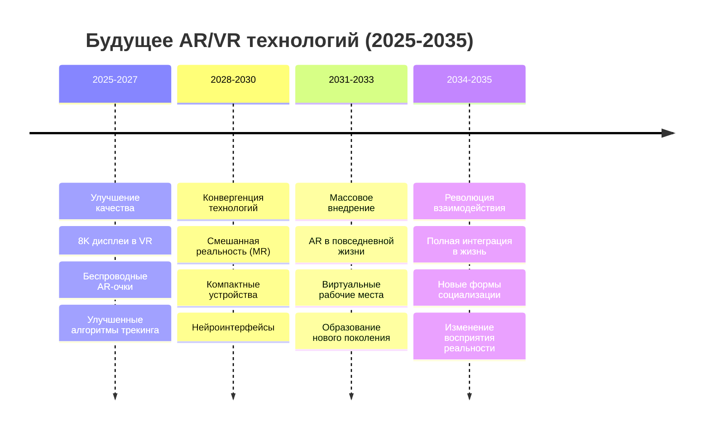

### Технологические направления развития

#### Удерживайте левой кнопкой мыши, чтобы выделить текст для читабельности!

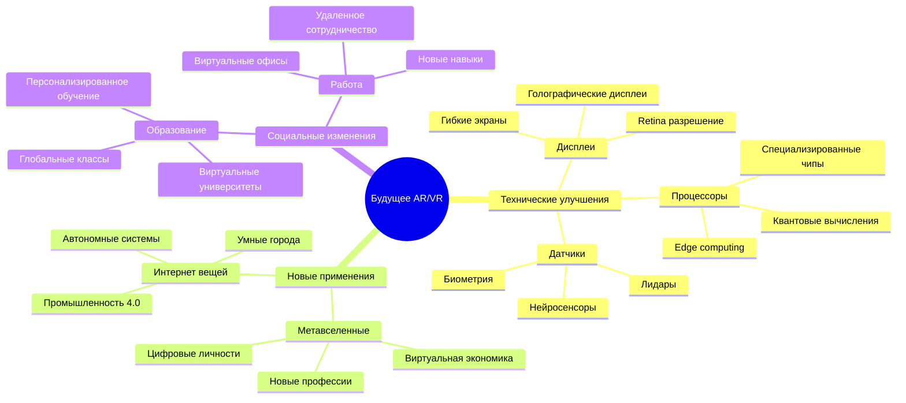

**Справка: Четыре промышленные революции**
- **1-я (конец XVIII в.)** — паровые машины и механизация производства
- **2-я (конец XIX в.)** — электричество и массовое конвейерное производство  
- **3-я (1970-80е гг.)** — компьютеры, автоматизация и программируемые системы
- **4-я (с 2010х гг.)** — интернет вещей, ИИ, роботизация и "умные фабрики"

Будущее этих технологий связано с их дальнейшим совершенствованием и сближением. Уже появляются устройства которые могут работать и в режиме VR, и в режиме AR. Улучшаются дисплеи, становясь более четкими и яркими. Уменьшается вес и размер устройств, что делает их более удобными для длительного использования.

Важно понимать что несмотря на бурное развитие, эти технологии все еще находятся на ранних стадиях своего развития. Много нюансов еще предстоит решить — от технических неполадок до создания качественного контента. Но уже сейчас ясно что AR и VR значительно меняют то, как мы взаимодействуем с информацией и цифровым миром вокруг нас.

## 7. Глоссарий терминов

### Основные понятия

| Термин | Расшифровка | Описание |
|--------|-------------|----------|
| **AR** | Augmented Reality | Дополненная реальность - наложение цифровых элементов на реальный мир |
| **VR** | Virtual Reality | Виртуальная реальность - полностью искусственная среда |
| **MR** | Mixed Reality | Смешанная реальность - гибрид AR и VR |
| **HMD** | Head-Mounted Display | Шлем виртуальной реальности |
| **FOV** | Field of View | Поле зрения - угол обзора в устройстве |
| **6DOF** | Six Degrees of Freedom | Шесть степеней свободы (движение по 3 осям + поворот) |
| **IPD** | Interpupillary Distance | Межзрачковое расстояние |
| **FPS** | Frames Per Second | Частота кадров (обычно 90+ для VR) |
| **Latency** | Motion-to-Photon Latency | Задержка от движения до отображения (<20ms для VR) |

### Технические термины

| Термин | Описание |
|--------|----------|
| **SLAM** | Simultaneous Localization and Mapping - одновременная локализация и картографирование |
| **Tracking** | Отслеживание положения устройства или пользователя в пространстве |
| **Haptic** | Тактильная обратная связь (вибрация, сопротивление) |
| **Passthrough** | Функция просмотра реального мира через VR-шлем |
| **Occlusion** | Перекрытие виртуальных объектов реальными |
| **Depth Sensing** | Определение глубины и расстояний до объектов |
| **Eye Tracking** | Отслеживание движений глаз пользователя |
| **Foveated Rendering** | Рендеринг с фокусом на центре зрения для оптимизации |
| **Киберболезнь** | Motion Sickness - тошнота от использования VR устройств |
| **Edge Computing** | Вычисления на краю сети для снижения задержек |

### Применения и индустрия

| Термин | Описание |
|--------|----------|
| **Digital Twin** | Цифровой двойник - виртуальная копия реального объекта |
| **Metaverse** | Метавселенная - виртуальные миры для социального взаимодействия |
| **Industry 4.0** | Четвертая промышленная революция с цифровыми технологиями |
| **Telepresence** | Эффект присутствия на расстоянии через VR/AR |
| **Simulation Training** | Обучение с использованием виртуальных симуляций |
| **Remote Assistance** | Удаленная помощь через AR-технологии |
| **IoT** | Internet of Things - интернет вещей |

## Заключение

В ходе изучения принципов функционирования AR и VR технологий можно выделить несколько ключевых выводов:

### Принципиальные различия
- **VR** = полная изоляция + создание искусственного мира
- **AR** = анализ реальности + наложение цифровых элементов

### Критические технические факторы
- **Частота кадров** ≥90 FPS для VR (предотвращение киберболезни)
- **Задержка** <20ms для комфортного использования
- **Точность трекинга** — основа пространственного понимания

### Эволюция подходов
От простых концепций 1930-х годов до современных систем с машинным обучением и реальным временем обработки.

### Практический результат
AR/VR перестали быть экспериментами и стали рабочими инструментами в медицине, образовании, промышленности.

**Главный вывод:** Понимание принципов работы этих технологий — не академический интерес, а практическая необходимость для эффективного применения в реальных задачах.
